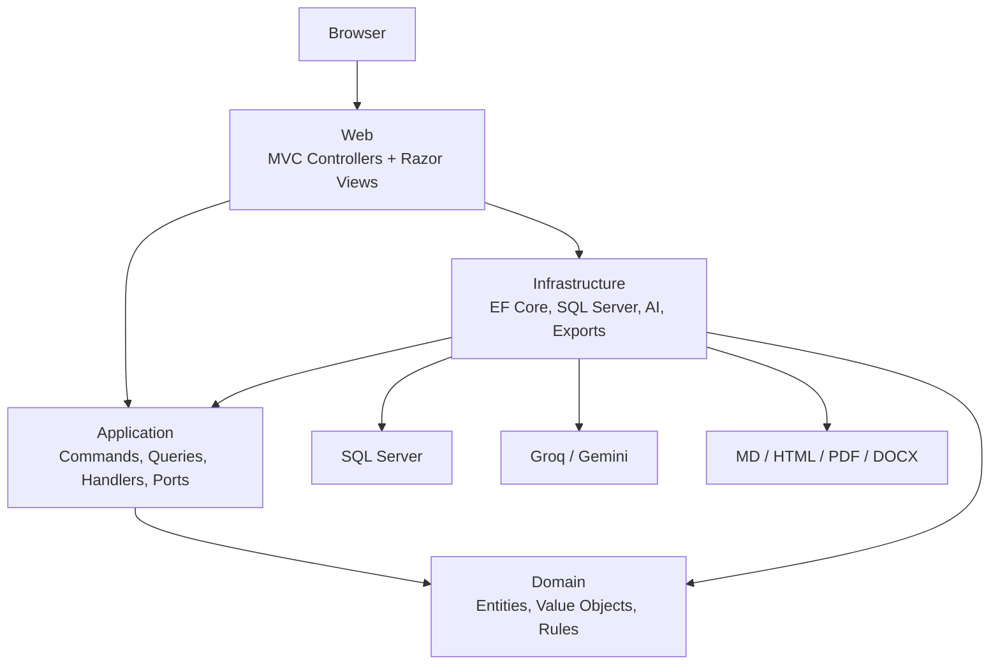

# Architecture Plan

## Project Name

Research Report Generator

## Goal

Build a serious ASP.NET Core MVC application for generating intelligent research and recommendation reports. The application should feel practical, product-like, and impressive to engineers because it follows Clean Architecture correctly while still delivering real features:

- User accounts
- Guided report creation
- AI report generation
- Smart style and criteria suggestions
- Report quality checks
- Report history and search
- Regeneration history
- Preview
- Markdown, HTML, PDF, and DOCX export

## Clean Architecture Correction

The previous architecture plan was too loose about the Application layer.

The corrected rule is:

- Application defines use cases, DTOs, validators, result types, pipeline behaviors, and ports.
- Application may contain command/query handlers because those are use case implementations.
- Application must not contain implementations for infrastructure-facing services such as AI providers, repositories, export renderers, document generators, HTTP clients, SQL Server access, Identity, file storage, or current HTTP user access.
- Infrastructure implements Application ports when the implementation depends on external technology.
- Web implements Presentation concerns and can implement web-specific adapters such as `CurrentUserService` because it depends on `HttpContext`.
- Domain contains business rules and pure domain concepts only.

So the corrected shape is not:

```text
Application/
  Services/
    IReportWorkflowService.cs
    ReportWorkflowService.cs
```

The corrected shape is:

```text
Application/
  Features/
    Reports/
      GenerateReport/
        GenerateReportCommand.cs
        GenerateReportCommandHandler.cs
  Abstractions/
    AI/
      IAiProvider.cs

Infrastructure/
  AI/
    GroqAiProvider.cs
    GeminiAiProvider.cs
```

The handler lives in Application because it is the use case. The AI provider implementation lives in Infrastructure because it performs external I/O.

## Architectural Style

Use a Clean Architecture modular monolith:

- One deployable ASP.NET Core MVC application.
- Multiple class library projects.
- Strict dependency direction.
- Use cases in Application.
- Adapters in Web and Infrastructure.

## Layer Rules

### Domain

Domain is the innermost layer.

Allowed:

- Entities
- Value objects
- Aggregates
- Domain events
- Domain errors
- Domain exceptions
- Pure domain services
- Business invariants

Forbidden:

- EF Core
- ASP.NET Core
- Identity
- HttpClient
- JSON attributes
- SQL Server
- AI SDKs
- File system
- Dependency injection
- Application DTOs
- View models

### Application

Application owns use cases.

Allowed:

- Commands
- Queries
- Command handlers
- Query handlers
- DTOs
- Result types
- Validators
- Pipeline behaviors
- Interfaces/ports required by use cases
- Pure policies that have no external I/O

Forbidden:

- EF Core `DbContext`
- SQL Server implementation
- ASP.NET Core MVC types
- Razor view models
- Identity implementation
- HttpClient
- Groq/Gemini concrete clients
- PDF/DOCX library implementation
- File system implementation
- Infrastructure project reference

### Infrastructure

Infrastructure implements technical adapters behind Application ports.

Allowed:

- EF Core
- SQL Server
- ASP.NET Core Identity persistence
- Repository implementations
- AI provider implementations
- Export implementations
- External HTTP calls
- Document-generation libraries
- Logging sinks
- Seed data
- Migrations

Forbidden:

- Business rules
- Razor views
- MVC controllers
- UI decisions
- Direct calls into Web

### Web

Web is the Presentation layer and composition root.

Allowed:

- Controllers
- Razor views
- View models
- Request/response mapping
- HTTP status selection
- Authentication UI
- MVC filters
- Middleware
- Static files
- DI composition root
- Web-specific adapter implementations such as current user from `HttpContext`

Forbidden:

- Business rules
- EF Core queries in controllers
- Direct AI provider calls in controllers
- Returning Domain entities directly to views
- Serializing EF Core entities or Domain aggregates directly

## Dependency Rules

Allowed project references:

```text
Domain
  References: none

Application
  References:
    Domain

Infrastructure
  References:
    Application
    Domain

Web
  References:
    Application
    Infrastructure

UnitTests
  References:
    Domain
    Application

IntegrationTests
  References:
    Web
    Application
    Infrastructure
```

Forbidden project references:

```text
Domain -> Application
Domain -> Infrastructure
Domain -> Web
Application -> Infrastructure
Application -> Web
Infrastructure -> Web
```

## High-Level Diagram



Important: `Web -> Infrastructure` exists only for DI composition and startup wiring. Controllers should talk to Application use cases, not Infrastructure classes.

## Solution Structure

```text
research-and-recommendation-report/
  ResearchReportGenerator.sln
  README.md
  LICENSE
  .gitignore

  docs/
    project-idea.md
    project-vision-statement.md
    task-breakdown-delegation-plan.md
    architecture-plan.md
    database-design.md
    user-flows.md
    prompt-design.md
    export-design.md
    testing-plan.md

  src/
    ResearchReportGenerator.Domain/
      ResearchReportGenerator.Domain.csproj

      Common/
        Entity.cs
        AggregateRoot.cs
        AuditableEntity.cs
        IDomainEvent.cs

      Reports/
        Entities/
          ReportRequest.cs
          ReportTopic.cs
          ReportCriterion.cs
          GeneratedReport.cs
          ReportGenerationRun.cs
          ReportCitation.cs
          ReportRecommendation.cs
          ReportTemplate.cs
          CriteriaPreset.cs
          ReportStylePreset.cs
        ValueObjects/
          ReportRequestId.cs
          GeneratedReportId.cs
          ReportTopicName.cs
          ReportTitle.cs
          ReportQualityScore.cs
          TokenUsage.cs
        Enums/
          AiProviderType.cs
          ExportFormat.cs
          GenerationStatus.cs
          RecommendationStrength.cs
          ReportLength.cs
          ReportStatus.cs
          ReportStyle.cs
          ReportVisibility.cs
          TechnicalDepth.cs
        Events/
          ReportRequestedDomainEvent.cs
          ReportGeneratedDomainEvent.cs
          ReportGenerationFailedDomainEvent.cs
          ReportExportedDomainEvent.cs
        Errors/
          ReportDomainError.cs
        Exceptions/
          ReportDomainException.cs

    ResearchReportGenerator.Application/
      ResearchReportGenerator.Application.csproj

      Common/
        Behaviors/
          AuthorizationBehavior.cs
          ValidationBehavior.cs
          LoggingBehavior.cs
          PerformanceBehavior.cs
          UnhandledExceptionBehavior.cs
        Errors/
          ApplicationError.cs
          ReportApplicationErrors.cs
        Interfaces/
          ICommand.cs
          ICommandHandler.cs
          IQuery.cs
          IQueryHandler.cs
        Models/
          PagedResult.cs
          Result.cs
          ResultOfT.cs

      Abstractions/
        AI/
          IAiProvider.cs
          IAiProviderFactory.cs
          IAiPromptComposer.cs
          IAiResponseParser.cs
        Auth/
          ICurrentUserService.cs
        Data/
          IApplicationDbContext.cs
          IUnitOfWork.cs
        Reports/
          IReportReadRepository.cs
          IReportWriteRepository.cs
          IReportTemplateReader.cs
          ICriteriaPresetReader.cs
          IReportStylePresetReader.cs
        Exports/
          IReportExportRenderer.cs
          IReportExportCoordinator.cs
        Time/
          IDateTimeProvider.cs

      DTOs/
        AI/
          AiGenerationRequest.cs
          AiGenerationResult.cs
          AiProviderHealthDto.cs
        Reports/
          ReportTopicDto.cs
          ReportCriterionDto.cs
          ReportInputOptionsDto.cs
          GeneratedReportDto.cs
          ReportPreviewDto.cs
          ReportHistoryItemDto.cs
          ReportDetailsDto.cs
          ReportGenerationRunDto.cs
          ReportQualityWarningDto.cs
        Exports/
          ExportReportDto.cs
          ExportReportResultDto.cs
        Presets/
          CriteriaPresetDto.cs
          ReportStylePresetDto.cs

      Features/
        Reports/
          CreateReportRequest/
            CreateReportRequestCommand.cs
            CreateReportRequestCommandHandler.cs
            CreateReportRequestCommandValidator.cs
            CreateReportRequestResult.cs
          GenerateReport/
            GenerateReportCommand.cs
            GenerateReportCommandHandler.cs
            GenerateReportCommandValidator.cs
            GenerateReportResult.cs
          RegenerateReport/
            RegenerateReportCommand.cs
            RegenerateReportCommandHandler.cs
            RegenerateReportCommandValidator.cs
            RegenerateReportResult.cs
          GetReportPreview/
            GetReportPreviewQuery.cs
            GetReportPreviewQueryHandler.cs
            GetReportPreviewResult.cs
          GetReportDetails/
            GetReportDetailsQuery.cs
            GetReportDetailsQueryHandler.cs
          GetReportHistory/
            GetReportHistoryQuery.cs
            GetReportHistoryQueryHandler.cs
          DeleteReport/
            DeleteReportCommand.cs
            DeleteReportCommandHandler.cs
            DeleteReportCommandValidator.cs
          SearchReports/
            SearchReportsQuery.cs
            SearchReportsQueryHandler.cs
        Exports/
          ExportReport/
            ExportReportCommand.cs
            ExportReportCommandHandler.cs
            ExportReportCommandValidator.cs
        Presets/
          GetCriteriaPresets/
            GetCriteriaPresetsQuery.cs
            GetCriteriaPresetsQueryHandler.cs
          GetStyleSuggestions/
            GetStyleSuggestionsQuery.cs
            GetStyleSuggestionsQueryHandler.cs
        Dashboard/
          GetDashboard/
            GetDashboardQuery.cs
            GetDashboardQueryHandler.cs

      Policies/
        ReportPromptComposer.cs
        ReportQualityPolicy.cs
        StyleSuggestionPolicy.cs
        CriteriaSuggestionPolicy.cs
        ReportTitleSuggestionPolicy.cs

      DependencyInjection.cs

    ResearchReportGenerator.Infrastructure/
      ResearchReportGenerator.Infrastructure.csproj

      AI/
        Common/
          AiProviderFactory.cs
          AiResponseParser.cs
          AiHttpClient.cs
          AiProviderFailureClassifier.cs
        Groq/
          GroqAiProvider.cs
          GroqOptions.cs
          GroqChatCompletionRequest.cs
          GroqChatCompletionResponse.cs
        Gemini/
          GeminiAiProvider.cs
          GeminiOptions.cs
          GeminiGenerateContentRequest.cs
          GeminiGenerateContentResponse.cs
        Fake/
          FakeAiProvider.cs

      Data/
        ApplicationDbContext.cs
        ApplicationDbContextFactory.cs
        UnitOfWork.cs
        Configurations/
          ReportRequestConfiguration.cs
          ReportTopicConfiguration.cs
          ReportCriterionConfiguration.cs
          GeneratedReportConfiguration.cs
          ReportGenerationRunConfiguration.cs
          ReportCitationConfiguration.cs
          ReportRecommendationConfiguration.cs
          ReportTemplateConfiguration.cs
          CriteriaPresetConfiguration.cs
          ReportStylePresetConfiguration.cs
        Identity/
          ApplicationUser.cs
          ApplicationRole.cs
          IdentitySeeder.cs
        Interceptors/
          AuditableEntitySaveChangesInterceptor.cs
          SoftDeleteSaveChangesInterceptor.cs
        Migrations/
        Seed/
          CriteriaPresetSeeder.cs
          ReportStylePresetSeeder.cs
          ReportTemplateSeeder.cs

      Reports/
        Repositories/
          EfReportReadRepository.cs
          EfReportWriteRepository.cs
          EfReportTemplateReader.cs
          EfCriteriaPresetReader.cs
          EfReportStylePresetReader.cs

      Exports/
        Common/
          ExportFileNameBuilder.cs
          MarkdownPipelineFactory.cs
          HtmlDocumentTemplate.cs
          ReportExportCoordinator.cs
        Markdown/
          MarkdownReportExportRenderer.cs
        Html/
          HtmlReportExportRenderer.cs
        Pdf/
          PdfReportExportRenderer.cs
          PdfOptions.cs
        Docx/
          DocxReportExportRenderer.cs
          DocxDocumentBuilder.cs

      Time/
        DateTimeProvider.cs

      DependencyInjection.cs

    ResearchReportGenerator.Web/
      ResearchReportGenerator.Web.csproj

      Controllers/
        HomeController.cs
        DashboardController.cs
        ReportsController.cs
        ExportsController.cs
        PresetsController.cs

      Areas/
        Identity/
          Pages/
            Account/
              Login.cshtml
              Login.cshtml.cs
              Register.cshtml
              Register.cshtml.cs
              Logout.cshtml
              Manage/
                Index.cshtml
                Index.cshtml.cs

      Adapters/
        CurrentUserService.cs

      Filters/
        MapApplicationResultFilter.cs
        ValidateAntiForgeryFilter.cs

      Middleware/
        ExceptionHandlingMiddleware.cs
        RequestCorrelationMiddleware.cs

      Mapping/
        DashboardViewModelMapper.cs
        ReportViewModelMapper.cs
        ExportViewModelMapper.cs
        ProblemDetailsMapper.cs

      ViewModels/
        Dashboard/
          DashboardViewModel.cs
          RecentReportViewModel.cs
          ProviderStatusViewModel.cs
        Reports/
          CreateReportViewModel.cs
          TopicInputViewModel.cs
          CriteriaInputViewModel.cs
          ReportHistoryViewModel.cs
          ReportHistoryItemViewModel.cs
          ReportDetailsViewModel.cs
          ReportPreviewViewModel.cs
          RegenerateReportViewModel.cs
          DeleteReportViewModel.cs
        Exports/
          ExportButtonsViewModel.cs
          ExportDownloadErrorViewModel.cs
        Presets/
          CriteriaPresetViewModel.cs
          StyleSuggestionViewModel.cs
        Shared/
          SelectOptionViewModel.cs
          ErrorViewModel.cs

      Views/
        Home/
          Index.cshtml
          Privacy.cshtml
        Dashboard/
          Index.cshtml
        Reports/
          Index.cshtml
          Create.cshtml
          Details.cshtml
          Preview.cshtml
          Regenerate.cshtml
          Delete.cshtml
        Exports/
          DownloadError.cshtml
        Shared/
          _Layout.cshtml
          _ValidationScriptsPartial.cshtml
          _StatusMessage.cshtml
          Error.cshtml
          Components/
            ReportStatusBadge.cshtml
            ExportButtons.cshtml
            QualityScoreBadge.cshtml
            CriteriaChips.cshtml
            CitationList.cshtml
            GenerationMetadata.cshtml

      wwwroot/
        css/
          site.css
          report-form.css
          report-preview.css
        js/
          create-report.js
          report-preview.js
          preset-suggestions.js

      Program.cs
      appsettings.json
      appsettings.Development.json

  tests/
    ResearchReportGenerator.ArchitectureTests/
      ResearchReportGenerator.ArchitectureTests.csproj
      DependencyRuleTests.cs
      LayerDependencyTests.cs
      NamingConventionTests.cs

    ResearchReportGenerator.DomainTests/
      ResearchReportGenerator.DomainTests.csproj
      Reports/
        ReportRequestTests.cs
        GeneratedReportTests.cs
        ReportQualityScoreTests.cs

    ResearchReportGenerator.ApplicationTests/
      ResearchReportGenerator.ApplicationTests.csproj
      Features/
        CreateReportRequestCommandHandlerTests.cs
        GenerateReportCommandHandlerTests.cs
        ExportReportCommandHandlerTests.cs
      Policies/
        ReportPromptComposerTests.cs
        ReportQualityPolicyTests.cs
        StyleSuggestionPolicyTests.cs

    ResearchReportGenerator.InfrastructureTests/
      ResearchReportGenerator.InfrastructureTests.csproj
      AI/
        FakeAiProviderTests.cs
        AiResponseParserTests.cs
      Exports/
        MarkdownReportExportRendererTests.cs
        HtmlReportExportRendererTests.cs
        DocxReportExportRendererTests.cs
      Data/
        ReportRepositoryTests.cs

    ResearchReportGenerator.IntegrationTests/
      ResearchReportGenerator.IntegrationTests.csproj
      TestWebApplicationFactory.cs
      Auth/
        AuthenticationFlowTests.cs
      Reports/
        ReportCreationFlowTests.cs
        ReportOwnershipTests.cs
        ReportHistoryTests.cs
      Exports/
        ReportExportFlowTests.cs

  scripts/
    setup-dev-db.ps1
    add-migration.ps1
    update-database.ps1
```

## What Each Layer Owns

### Domain Owns

`ReportRequest`

- Ensures report request has a title.
- Ensures at least two topics.
- Ensures valid criteria list.
- Tracks status changes.
- Raises domain events.

`GeneratedReport`

- Holds canonical Markdown content.
- Tracks generation status.
- Owns quality score value object.
- Guards invalid state transitions.

`ReportGenerationRun`

- Records a generation attempt.
- Tracks provider, model, token usage, duration, success or failure.

`CriteriaPreset` and `ReportStylePreset`

- Represent built-in product vocabulary.
- Do not know how they are stored.

### Application Owns

Use cases:

- Create report request
- Generate report
- Regenerate report
- Preview report
- Search report history
- Delete report
- Export report
- Get criteria presets
- Get style suggestions
- Get dashboard

Ports:

- `IAiProvider`
- `IAiProviderFactory`
- `IReportReadRepository`
- `IReportWriteRepository`
- `IReportExportRenderer`
- `IReportExportCoordinator`
- `ICurrentUserService`
- `IDateTimeProvider`
- `IUnitOfWork`

Pure policies:

- `ReportPromptComposer`
- `ReportQualityPolicy`
- `StyleSuggestionPolicy`
- `CriteriaSuggestionPolicy`
- `ReportTitleSuggestionPolicy`

These are allowed in Application only because they do not talk to databases, files, HTTP, AI APIs, or framework-specific services.

### Infrastructure Owns

Implementations:

- `GroqAiProvider : IAiProvider`
- `GeminiAiProvider : IAiProvider`
- `FakeAiProvider : IAiProvider`
- `EfReportReadRepository : IReportReadRepository`
- `EfReportWriteRepository : IReportWriteRepository`
- `ReportExportCoordinator : IReportExportCoordinator`
- `MarkdownReportExportRenderer : IReportExportRenderer`
- `HtmlReportExportRenderer : IReportExportRenderer`
- `PdfReportExportRenderer : IReportExportRenderer`
- `DocxReportExportRenderer : IReportExportRenderer`
- `DateTimeProvider : IDateTimeProvider`

### Web Owns

Implementations:

- `CurrentUserService : ICurrentUserService`

Reason:

- It reads `HttpContext.User`, so it belongs to the web adapter layer, not Application.

## Complete User Flows

### Flow 1: Visitor Opens App

1. Visitor opens `/`.
2. `HomeController.Index` returns landing page.
3. Visitor sees product purpose and actions.
4. Visitor chooses register or login.

Layer path:

```text
Browser -> Web only
```

### Flow 2: User Registers

1. User opens register page.
2. Web Identity UI accepts email, password, display name.
3. ASP.NET Core Identity creates user.
4. User is signed in.
5. Web redirects to dashboard.

Layer path:

```text
Web -> Infrastructure Identity persistence -> SQL Server
```

### Flow 3: User Opens Dashboard

1. User opens `/dashboard`.
2. `DashboardController.Index` maps HTTP request to `GetDashboardQuery`.
3. Query handler asks `IReportReadRepository` for user report summary.
4. Infrastructure repository queries SQL Server.
5. Application returns dashboard DTO.
6. Web maps DTO to view model.
7. Razor view renders dashboard.

Layer path:

```text
Web -> Application query -> Infrastructure repository -> SQL Server
```

### Flow 4: User Starts Guided Report Creation

1. User clicks `New Report`.
2. `ReportsController.Create` loads criteria presets and style presets through Application queries.
3. Web renders guided form.

Wizard steps:

1. Report goal and title
2. Topics to compare
3. Target audience
4. Report style
5. Technical depth and length
6. Criteria
7. Optional constraints
8. Review and generate

### Flow 5: Style and Criteria Suggestions

1. User enters topics or category.
2. Browser calls `PresetsController`.
3. Controller sends `GetStyleSuggestionsQuery` or `GetCriteriaPresetsQuery`.
4. Application uses pure suggestion policies and preset readers.
5. Web returns JSON for UI suggestions.

Important:

- Suggestions can be rule-based first.
- AI-assisted suggestions can be added later through `IAiProvider`.

### Flow 6: User Submits Report Request

1. User submits create form.
2. Web validates request shape.
3. Web maps view model to `CreateReportRequestCommand`.
4. Application validator checks use-case input.
5. Handler creates `ReportRequest` domain entity.
6. Domain validates invariants.
7. Handler saves through `IReportWriteRepository`.
8. Handler commits through `IUnitOfWork`.
9. Web redirects to generation or preview route.

No controller talks to EF Core.

### Flow 7: AI Generation Succeeds

1. Web sends `GenerateReportCommand`.
2. Handler loads report request by user ID.
3. Handler calls `ReportPromptComposer`.
4. Handler calls `IAiProviderFactory`.
5. Factory returns configured provider.
6. Provider implementation in Infrastructure calls Groq or Gemini.
7. Handler receives `AiGenerationResult`.
8. Handler parses/validates generated Markdown through Application parser interface or pure parser.
9. Handler calculates quality score through `ReportQualityPolicy`.
10. Handler creates `GeneratedReport`.
11. Handler stores `GeneratedReport` and `ReportGenerationRun`.
12. Handler commits unit of work.
13. Web redirects to preview.

Layer path:

```text
Web -> Application handler -> Application port -> Infrastructure AI -> External AI
Application handler -> Infrastructure repository -> SQL Server
```

### Flow 8: AI Generation Fails

1. Provider times out, rate limits, or returns invalid content.
2. Infrastructure provider returns failed `AiGenerationResult` for expected provider-level failures or throws for unexpected infrastructure failures.
3. Handler stores failed `ReportGenerationRun`.
4. Handler returns `Result.Failure`.
5. Web maps Application error to friendly message.
6. User can retry or switch provider.

### Flow 9: User Previews Report

1. User opens report preview.
2. Web sends `GetReportPreviewQuery`.
3. Handler loads report using current user ID.
4. Application returns `ReportPreviewDto`.
5. Web maps DTO to `ReportPreviewViewModel`.
6. View renders Markdown preview, metadata, quality score, warnings, citations, and export buttons.

### Flow 10: User Downloads Export

1. User clicks Markdown, HTML, PDF, or DOCX.
2. Web sends `ExportReportCommand`.
3. Handler verifies report ownership through repository query.
4. Handler calls `IReportExportCoordinator`.
5. Infrastructure coordinator selects renderer.
6. Renderer creates file bytes.
7. Handler returns `ExportReportResultDto`.
8. Web returns `File(...)` response.

No export renderer lives in Application.

### Flow 11: User Searches Report History

1. User opens report history.
2. User searches by title, topic, date, status, style, or provider.
3. Web sends `SearchReportsQuery`.
4. Infrastructure read repository performs query.
5. Application returns paged result.
6. Web renders history list.

### Flow 12: User Regenerates Report

1. User opens preview.
2. User clicks regenerate.
3. User optionally changes provider, style, depth, or extra notes.
4. Web sends `RegenerateReportCommand`.
5. Handler creates a new `ReportGenerationRun`.
6. Handler generates a new `GeneratedReport` version.
7. Previous generation remains in history.
8. User previews latest generated version.

### Flow 13: User Deletes Report

1. User clicks delete.
2. Web shows confirmation.
3. Web sends `DeleteReportCommand`.
4. Handler verifies ownership.
5. Domain marks report as deleted or repository applies soft delete.
6. Report disappears from normal history.

### Flow 14: Developer Adds a New AI Provider

1. Add `NewProviderOptions` in Infrastructure.
2. Add `NewProviderAiProvider : IAiProvider` in Infrastructure.
3. Register provider in `Infrastructure.DependencyInjection`.
4. Update provider factory.
5. Application handlers do not change.
6. Web controllers do not change.

## Main Use Cases

### CreateReportRequestCommandHandler

Responsibilities:

- Get current user ID through `ICurrentUserService`.
- Create `ReportRequest` domain entity.
- Validate domain invariants through domain methods.
- Save through `IReportWriteRepository`.
- Commit through `IUnitOfWork`.
- Return `CreateReportRequestResult`.

Does not:

- Call AI provider.
- Use EF Core.
- Use `HttpContext`.

### GenerateReportCommandHandler

Responsibilities:

- Load report request.
- Verify ownership.
- Compose prompt.
- Call AI provider port.
- Create generation run.
- Create generated report.
- Run quality policy.
- Save and commit.

Does not:

- Know whether provider is Groq or Gemini.
- Know SQL Server.
- Know PDF/DOCX details.

### ExportReportCommandHandler

Responsibilities:

- Verify ownership.
- Load generated report.
- Call export coordinator port.
- Return export DTO.

Does not:

- Use Open XML SDK directly.
- Use PDF library directly.
- Use file system directly.

## Database Tables

Identity tables:

```text
AspNetUsers
AspNetRoles
AspNetUserClaims
AspNetUserLogins
AspNetUserRoles
AspNetUserTokens
AspNetRoleClaims
```

Application tables:

```text
ReportRequests
  Id
  UserId
  Title
  TargetAudience
  ReportStyle
  TechnicalDepth
  ReportLength
  IndustryOrDomain
  CurrentTechnologyStack
  PerformanceRequirements
  SecurityRequirements
  BudgetConsiderations
  MustInclude
  MustAvoid
  PreferredAiProvider
  Status
  CreatedAtUtc
  UpdatedAtUtc
  DeletedAtUtc

ReportTopics
  Id
  ReportRequestId
  Name
  Description
  SortOrder

ReportCriteria
  Id
  ReportRequestId
  Name
  Description
  Weight
  SortOrder

GeneratedReports
  Id
  ReportRequestId
  UserId
  Title
  MarkdownContent
  Summary
  AiProvider
  ModelName
  PromptVersion
  Status
  QualityScore
  QualityWarningsJson
  GeneratedAtUtc
  UpdatedAtUtc
  DeletedAtUtc

ReportGenerationRuns
  Id
  ReportRequestId
  GeneratedReportId
  UserId
  AiProvider
  ModelName
  PromptText
  RawResponse
  Status
  ErrorCode
  ErrorMessage
  StartedAtUtc
  CompletedAtUtc
  DurationMs
  InputTokens
  OutputTokens

ReportCitations
  Id
  GeneratedReportId
  Title
  Url
  SourceName
  PublishedAtUtc
  AccessedAtUtc
  Notes
  SortOrder

ReportRecommendations
  Id
  GeneratedReportId
  Scenario
  RecommendedOption
  Reasoning
  Strength
  SortOrder

ReportTemplates
  Id
  Name
  Description
  SystemPrompt
  UserPromptTemplate
  IsActive
  CreatedAtUtc
  UpdatedAtUtc

CriteriaPresets
  Id
  Name
  Description
  Category
  CriteriaJson
  IsActive
  SortOrder

ReportStylePresets
  Id
  Name
  Description
  RecommendedAudience
  DefaultDepth
  IsActive
  SortOrder

ReportExports
  Id
  GeneratedReportId
  UserId
  ExportFormat
  FileName
  ContentType
  CreatedAtUtc
```

## AI Architecture

Application contract:

```csharp
public interface IAiProvider
{
    AiProviderType ProviderType { get; }

    Task<AiGenerationResult> GenerateAsync(
        AiGenerationRequest request,
        CancellationToken cancellationToken);
}
```

Infrastructure implementations:

```text
GroqAiProvider
GeminiAiProvider
FakeAiProvider
```

Provider selection:

- `IAiProviderFactory` lives in Application.
- `AiProviderFactory` implementation lives in Infrastructure.
- Handlers ask for a provider by type.
- Handlers do not know concrete provider classes.

Prompt generation:

- `ReportPromptComposer` can live in Application because it is pure string composition.
- Prompt templates can be read through `IReportTemplateReader`.
- SQL-backed template reader lives in Infrastructure.

## Export Architecture

Application contract:

```csharp
public interface IReportExportRenderer
{
    ExportFormat Format { get; }

    Task<ExportReportResultDto> RenderAsync(
        GeneratedReportDto report,
        CancellationToken cancellationToken);
}
```

Infrastructure implementations:

```text
MarkdownReportExportRenderer
HtmlReportExportRenderer
PdfReportExportRenderer
DocxReportExportRenderer
```

Rules:

- Markdown is canonical.
- HTML is rendered from Markdown.
- PDF is rendered from HTML or a PDF document library.
- DOCX is rendered through Open XML or a document library.
- No export implementation belongs in Application.
- Web only returns the generated file response.

## Error Handling

Use Result types for expected failures:

- Report not found
- User does not own report
- Invalid report request
- AI returned empty output
- Unsupported export format
- Quality validation failed

Use exceptions for unexpected failures:

- SQL Server unavailable
- AI provider network timeout
- File/rendering library crash
- Programming errors

Mapping:

```text
Domain error -> Application error -> Web ProblemDetails or MVC validation message
Infrastructure exception -> Web exception middleware -> friendly error page / 503
```

## Security Rules

Required:

- Authentication required for dashboard, reports, generation, preview, export, regeneration, delete.
- Every report query includes current user ID.
- Controllers do not check database ownership directly.
- Use cases check ownership through repositories.
- Anti-forgery tokens on forms.
- Server-side validation on commands.
- API keys stored in user secrets or environment variables.
- No generated prompt secrets in logs.
- Optional prompt logging must be configurable and disabled by default.

Ownership query pattern in Infrastructure:

```csharp
await db.GeneratedReports
    .Where(report => report.UserId == userId)
    .Where(report => report.Id == reportId)
    .Where(report => report.DeletedAtUtc == null)
    .FirstOrDefaultAsync(cancellationToken);
```

## Cross-Cutting Concerns

Application pipeline behaviors:

- `ValidationBehavior`
- `AuthorizationBehavior`
- `LoggingBehavior`
- `PerformanceBehavior`
- `UnhandledExceptionBehavior`

Rules:

- Behaviors must not reference Infrastructure implementations.
- Behaviors may depend on Application abstractions.
- Behaviors may use framework abstractions such as `ILogger<T>`.
- Behaviors must not use Serilog static APIs directly.

Web middleware:

- Exception handling
- Correlation ID
- Authentication
- Authorization
- Static files

Infrastructure interceptors:

- Audit columns
- Soft delete
- Slow query logging

## DI Registration

Application:

```csharp
services.AddApplication();
```

Registers:

- MediatR handlers
- Validators
- Pipeline behaviors
- Pure policies

Infrastructure:

```csharp
services.AddInfrastructure(configuration);
```

Registers:

- EF Core
- Identity stores
- Repositories
- AI providers
- Export renderers
- Unit of work
- Date/time provider

Web:

```csharp
services.AddScoped<ICurrentUserService, CurrentUserService>();
```

Registers:

- MVC
- Razor views
- Identity UI
- HttpContext accessor
- Web adapters

## Suggested NuGet Packages

Domain:

- No package preferred

Application:

- `MediatR`
- `FluentValidation`

Infrastructure:

- `Microsoft.EntityFrameworkCore.SqlServer`
- `Microsoft.EntityFrameworkCore.Tools`
- `Microsoft.AspNetCore.Identity.EntityFrameworkCore`
- `Markdig`
- `DocumentFormat.OpenXml`
- PDF package selected during implementation

Web:

- `Microsoft.AspNetCore.Identity.UI`

Tests:

- `xunit`
- `FluentAssertions`
- `Moq` or `NSubstitute`
- `Microsoft.AspNetCore.Mvc.Testing`
- `NetArchTest.Rules`

## Architecture Fitness Tests

Required tests:

```text
Domain must not reference Application
Domain must not reference Infrastructure
Domain must not reference Web
Application must not reference Infrastructure
Application must not reference Web
Web controllers must not reference Infrastructure namespaces
Web controllers must not reference Domain entities directly
Infrastructure must implement Application ports
Application handlers must not use EF Core namespaces
Application handlers must not use HttpClient
Application handlers must not use ASP.NET Core MVC types
```

These tests should run in CI and block merges.

## Build Phases

### Phase 1: Solution Foundation

1. Create solution.
2. Create Domain, Application, Infrastructure, Web, and test projects.
3. Add project references exactly as listed.
4. Add architecture tests first.
5. Add base Result, command, query, and entity types.

### Phase 2: Authentication and Persistence

1. Add ASP.NET Core Identity.
2. Add SQL Server EF Core configuration.
3. Add `ApplicationDbContext`.
4. Add migrations.
5. Add seeders for criteria and style presets.

### Phase 3: Report Request Flow Without AI

1. Build dashboard.
2. Build guided create report flow.
3. Add create request command.
4. Save report request.
5. Add fake AI provider.
6. Generate sample Markdown.
7. Save generated report.
8. Preview report.

### Phase 4: Real AI Integration

1. Add Groq provider.
2. Add Gemini provider if time allows.
3. Add provider selection.
4. Add prompt composer.
5. Add generation run metadata.
6. Add retry/failure handling.

### Phase 5: Product Quality Features

1. Add criteria presets.
2. Add style suggestions.
3. Add quality score.
4. Add quality warnings.
5. Add regeneration.
6. Add report history search.

### Phase 6: Exports

1. Markdown export.
2. HTML export.
3. PDF export.
4. DOCX export.
5. Export buttons in preview.
6. Download failure handling.

### Phase 7: Testing and Polish

1. Domain tests.
2. Application handler tests with fake ports.
3. Infrastructure export tests.
4. Integration tests for ownership.
5. UI polish.
6. README setup.

## Features That Make the App Feel Impressive

- Guided report wizard
- Smart criteria presets
- Style suggestions
- Fake AI provider for deterministic tests
- Real Groq/Gemini provider abstraction
- AI generation run history
- Quality score and warnings
- Markdown canonical content
- Multi-format export
- Regeneration with changed settings
- Searchable report history
- Strict user ownership
- Architecture fitness tests
- Clean error mapping
- Provider health display
- Seeded presets
- Soft delete
- Clear product dashboard

## Definition of Done

The architecture is correct when:

- Domain has no dependency on Application, Infrastructure, Web, EF Core, or ASP.NET Core.
- Application references Domain only.
- Application contains use cases and ports, not Infrastructure implementations.
- Infrastructure implements persistence, AI, export, and technical adapters.
- Web controllers dispatch Application commands and queries only.
- Web maps view models to Application DTOs and results back to views.
- No Domain entities are passed directly to Razor views.
- No controller calls `DbContext`.
- No Application handler references `HttpClient`, `DbContext`, or MVC types.
- Architecture tests enforce these rules.
- Users can register, generate reports, preview, regenerate, search history, and export all formats.
