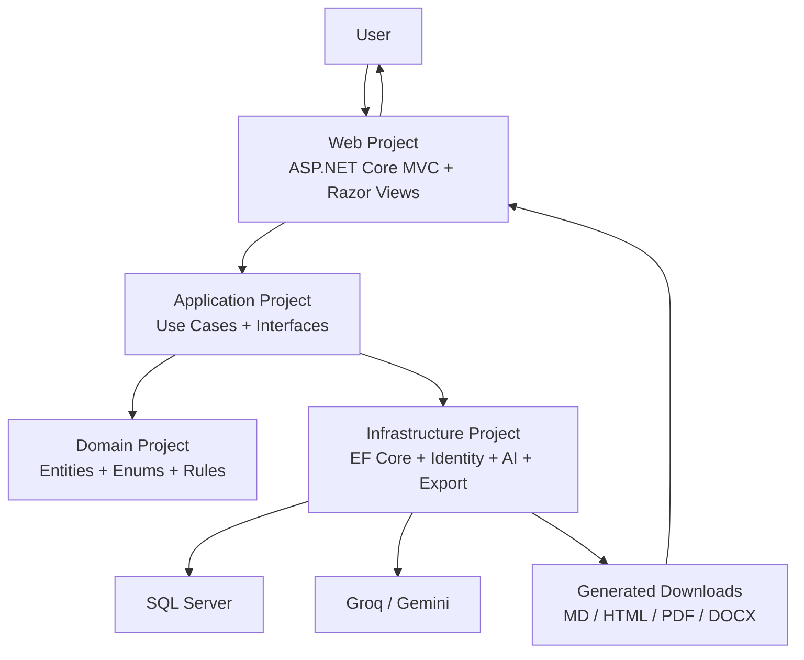

# Architecture Plan

## Project Name

Research Report Generator

## Product Goal

Build a professional ASP.NET Core application that allows users to generate intelligent research and recommendation reports. The app should feel practical enough for real users and impressive enough that other developers can see strong architecture, thoughtful AI integration, and product sense.

The application is not only a portfolio demo. It should look like the foundation of a real product.

## Architecture Philosophy

Use a multi-project ASP.NET Core MVC solution.

The app will still be simple to run as one web application, but the code will be separated into class libraries so the architecture is clear:

- `Domain`: business entities, enums, and domain rules
- `Application`: use cases, interfaces, DTOs, validation, orchestration
- `Infrastructure`: SQL Server, EF Core, Identity, AI providers, exports, external services
- `Web`: MVC controllers, Razor views, view models, UI, authentication pages
- `Tests`: unit and integration tests

This gives the project a serious enterprise .NET shape without forcing a separate API and Angular frontend.

## High-Level Architecture



## Solution Structure

```text
research-and-recommendation-report/
  ResearchReportGenerator.sln
  README.md
  LICENSE
  .gitignore

  docs/
    project-idea.md
    project-vision-statement.md
    task-breakdown-delegation-plan.md
    architecture-plan.md
    database-design.md
    user-flows.md
    prompt-design.md
    export-design.md
    testing-plan.md

  src/
    ResearchReportGenerator.Domain/
      ResearchReportGenerator.Domain.csproj

      Common/
        Entity.cs
        AuditableEntity.cs
        IHasUserOwnership.cs

      Entities/
        ReportRequest.cs
        ReportTopic.cs
        ReportCriterion.cs
        GeneratedReport.cs
        ReportSection.cs
        ReportRecommendation.cs
        ReportCitation.cs
        ReportExport.cs
        ReportGenerationRun.cs
        ReportTemplate.cs
        ReportStylePreset.cs
        CriteriaPreset.cs
        UserSavedReport.cs

      Enums/
        AiProviderType.cs
        ExportFormat.cs
        GenerationStage.cs
        RecommendationStrength.cs
        ReportLength.cs
        ReportStatus.cs
        ReportStyle.cs
        ReportVisibility.cs
        TechnicalDepth.cs

      ValueObjects/
        ReportInputOptions.cs
        ReportQualityScore.cs
        TokenUsage.cs

      Exceptions/
        DomainException.cs
        ReportOwnershipException.cs
        UnsupportedExportFormatException.cs

    ResearchReportGenerator.Application/
      ResearchReportGenerator.Application.csproj

      Abstractions/
        AI/
          IAiProvider.cs
          IAiProviderFactory.cs
          IAiPromptBuilder.cs
          IAiResponseParser.cs
        Auth/
          ICurrentUserService.cs
        Data/
          IApplicationDbContext.cs
          IUnitOfWork.cs
        Exports/
          IReportExportService.cs
          IReportExportCoordinator.cs
        Reports/
          IReportWorkflowService.cs
          IReportQualityService.cs
          IReportTemplateService.cs
          IReportSearchService.cs
        Time/
          IDateTimeProvider.cs

      DTOs/
        AI/
          AiGenerationRequest.cs
          AiGenerationResult.cs
          AiProviderHealthResult.cs
        Exports/
          ExportReportRequest.cs
          ExportReportResult.cs
        Reports/
          CreateReportRequestDto.cs
          CreateReportResultDto.cs
          GenerateReportCommand.cs
          GeneratedReportDto.cs
          ReportCriterionDto.cs
          ReportDetailsDto.cs
          ReportHistoryItemDto.cs
          ReportPreviewDto.cs
          ReportRegenerationRequestDto.cs
          ReportTopicDto.cs
          SourceCitationDto.cs

      Features/
        Reports/
          CreateReport/
            CreateReportCommand.cs
            CreateReportCommandHandler.cs
            CreateReportValidator.cs
          GenerateReport/
            GenerateReportCommand.cs
            GenerateReportCommandHandler.cs
            GenerateReportValidator.cs
          GetReportDetails/
            GetReportDetailsQuery.cs
            GetReportDetailsQueryHandler.cs
          GetReportHistory/
            GetReportHistoryQuery.cs
            GetReportHistoryQueryHandler.cs
          PreviewReport/
            PreviewReportQuery.cs
            PreviewReportQueryHandler.cs
          RegenerateReport/
            RegenerateReportCommand.cs
            RegenerateReportCommandHandler.cs
          DeleteReport/
            DeleteReportCommand.cs
            DeleteReportCommandHandler.cs
        Exports/
          ExportReport/
            ExportReportCommand.cs
            ExportReportCommandHandler.cs
        Presets/
          GetCriteriaPresets/
            GetCriteriaPresetsQuery.cs
            GetCriteriaPresetsQueryHandler.cs
          GetStyleSuggestions/
            GetStyleSuggestionsQuery.cs
            GetStyleSuggestionsQueryHandler.cs

      Mapping/
        ReportMappingProfile.cs

      Options/
        AiOptions.cs
        ExportOptions.cs
        ReportGenerationOptions.cs

      Services/
        ReportWorkflowService.cs
        ReportQualityService.cs
        ReportTemplateService.cs
        ReportSearchService.cs
        StyleSuggestionService.cs

      DependencyInjection.cs

    ResearchReportGenerator.Infrastructure/
      ResearchReportGenerator.Infrastructure.csproj

      AI/
        Common/
          AiHttpClient.cs
          AiProviderFactory.cs
          AiProviderFailureHandler.cs
          AiPromptBuilder.cs
          AiResponseParser.cs
          PromptTemplateLoader.cs
        Groq/
          GroqAiProvider.cs
          GroqOptions.cs
          GroqRequest.cs
          GroqResponse.cs
        Gemini/
          GeminiAiProvider.cs
          GeminiOptions.cs
          GeminiRequest.cs
          GeminiResponse.cs
        Fake/
          FakeAiProvider.cs

      Data/
        ApplicationDbContext.cs
        ApplicationDbContextFactory.cs
        Configurations/
          ReportRequestConfiguration.cs
          ReportTopicConfiguration.cs
          ReportCriterionConfiguration.cs
          GeneratedReportConfiguration.cs
          ReportSectionConfiguration.cs
          ReportRecommendationConfiguration.cs
          ReportCitationConfiguration.cs
          ReportExportConfiguration.cs
          ReportGenerationRunConfiguration.cs
          ReportTemplateConfiguration.cs
          ReportStylePresetConfiguration.cs
          CriteriaPresetConfiguration.cs
        Identity/
          ApplicationUser.cs
          ApplicationRole.cs
          IdentitySeeder.cs
        Migrations/
        Seed/
          CriteriaPresetSeeder.cs
          ReportStylePresetSeeder.cs
          ReportTemplateSeeder.cs

      Exports/
        Common/
          ExportFileNameBuilder.cs
          MarkdownPipelineFactory.cs
          ReportHtmlTemplateBuilder.cs
          ReportExportCoordinator.cs
        Markdown/
          MarkdownExportService.cs
        Html/
          HtmlExportService.cs
        Pdf/
          PdfExportService.cs
          PdfOptions.cs
        Docx/
          DocxExportService.cs
          DocxDocumentBuilder.cs

      Persistence/
        UnitOfWork.cs

      Services/
        CurrentUserService.cs
        DateTimeProvider.cs

      DependencyInjection.cs

    ResearchReportGenerator.Web/
      ResearchReportGenerator.Web.csproj

      Areas/
        Identity/
          Pages/
            Account/
              Login.cshtml
              Login.cshtml.cs
              Register.cshtml
              Register.cshtml.cs
              Logout.cshtml
              Logout.cshtml.cs
              Manage/
                Index.cshtml
                Index.cshtml.cs

      Controllers/
        HomeController.cs
        ReportsController.cs
        ExportsController.cs
        PresetsController.cs
        SettingsController.cs

      Filters/
        ValidateReportOwnershipFilter.cs

      Middleware/
        ExceptionHandlingMiddleware.cs

      Models/
        ErrorViewModel.cs

      ViewModels/
        Dashboard/
          DashboardViewModel.cs
        Reports/
          CreateReportViewModel.cs
          CriteriaInputViewModel.cs
          TopicInputViewModel.cs
          ReportDetailsViewModel.cs
          ReportHistoryViewModel.cs
          ReportHistoryItemViewModel.cs
          ReportPreviewViewModel.cs
          RegenerateReportViewModel.cs
        Exports/
          ExportOptionsViewModel.cs
        Shared/
          SelectOptionViewModel.cs

      Views/
        Home/
          Index.cshtml
          Privacy.cshtml
        Reports/
          Index.cshtml
          Create.cshtml
          Details.cshtml
          Preview.cshtml
          Regenerate.cshtml
          Delete.cshtml
        Exports/
          DownloadError.cshtml
        Settings/
          Index.cshtml
        Shared/
          _Layout.cshtml
          _ValidationScriptsPartial.cshtml
          _StatusMessage.cshtml
          Error.cshtml
          Components/
            ReportStatusBadge.cshtml
            ExportButtons.cshtml
            QualityScoreBadge.cshtml
            CriteriaChips.cshtml
            CitationList.cshtml

      wwwroot/
        css/
          site.css
          report-preview.css
        js/
          create-report.js
          report-preview.js
        lib/

      appsettings.json
      appsettings.Development.json
      Program.cs

  tests/
    ResearchReportGenerator.UnitTests/
      ResearchReportGenerator.UnitTests.csproj
      Application/
        ReportPromptBuilderTests.cs
        ReportQualityServiceTests.cs
        StyleSuggestionServiceTests.cs
        ReportWorkflowServiceTests.cs
      Domain/
        ReportRequestTests.cs
      Exports/
        MarkdownExportServiceTests.cs
        HtmlExportServiceTests.cs

    ResearchReportGenerator.IntegrationTests/
      ResearchReportGenerator.IntegrationTests.csproj
      TestWebApplicationFactory.cs
      Reports/
        ReportCreationFlowTests.cs
        ReportOwnershipTests.cs
      Exports/
        ReportExportTests.cs
      Auth/
        AuthenticationFlowTests.cs

  scripts/
    setup-dev-db.ps1
    add-migration.ps1
    update-database.ps1
```

## Project References

```text
ResearchReportGenerator.Domain
  No project references

ResearchReportGenerator.Application
  References:
    ResearchReportGenerator.Domain

ResearchReportGenerator.Infrastructure
  References:
    ResearchReportGenerator.Application
    ResearchReportGenerator.Domain

ResearchReportGenerator.Web
  References:
    ResearchReportGenerator.Application
    ResearchReportGenerator.Infrastructure

ResearchReportGenerator.UnitTests
  References:
    ResearchReportGenerator.Application
    ResearchReportGenerator.Domain
    ResearchReportGenerator.Infrastructure

ResearchReportGenerator.IntegrationTests
  References:
    ResearchReportGenerator.Web
    ResearchReportGenerator.Application
    ResearchReportGenerator.Infrastructure
```

## Main Features

### 1. Authentication and User Ownership

Users can:

- Register
- Log in
- Log out
- Manage basic profile information
- See only their own reports
- Generate reports under their own account
- Reopen previous reports

Important rule:

Every report-related query must include the current user's ID.

### 2. Dashboard

The dashboard should show:

- Total reports generated by the user
- Recent reports
- Draft or failed report requests
- Quick button to create a new report
- Most used report styles
- Export shortcuts for recent reports
- AI provider status indicator

This makes the app feel like a real product instead of a single-form demo.

### 3. Guided Report Creation Wizard

The create report screen should feel guided, not like a boring long form.

Steps:

1. Choose report goal
2. Add topics to compare
3. Choose audience and report style
4. Choose technical depth
5. Select comparison criteria
6. Add optional constraints
7. Review and generate

Inputs:

- Report title
- Topics to compare
- Target audience
- Report style
- Technical depth
- Report length
- Preferred criteria
- Industry or domain
- Current technology stack
- Performance needs
- Security needs
- Budget considerations
- Must include notes
- Must avoid notes
- Preferred AI provider

### 4. Smart Suggestions

The app should suggest useful options instead of forcing the user to think from nothing.

Suggested features:

- Suggest report style based on selected goal
- Suggest comparison criteria based on topic category
- Suggest technical depth based on audience
- Suggest report title from topics
- Suggest missing criteria such as cost, security, scalability, maintainability, integration, learning curve, support, and vendor maturity

These suggestions can start as rule-based logic, then later become AI-assisted.

### 5. AI Report Generation

The AI generation pipeline should:

- Build a structured prompt from user input
- Select the configured AI provider
- Generate Markdown as the canonical report content
- Parse and validate the output
- Save the generated report
- Store generation metadata
- Handle failures clearly

The generated report should include:

1. Executive Summary
2. Problem Context
3. Topic Explanations
4. Relationship Between Topics
5. Comparison Criteria
6. Comparison Table
7. Decision Matrix
8. Recommended Choice by Scenario
9. Risks and Tradeoffs
10. Implementation Notes
11. Small Code or Configuration Examples if useful
12. Final Recommendation
13. References or Source Notes

### 6. Report Quality Score

To make the app more impressive, add a lightweight quality check after AI generation.

Checks:

- Required sections exist
- All topics are mentioned
- Recommendation section exists
- Comparison table exists
- Report has enough depth for selected level
- Markdown is valid enough to render
- Report is not too short
- Report does not include obvious placeholder text

Store:

- `OverallScore`
- `CompletenessScore`
- `ClarityScore`
- `RecommendationScore`
- `Warnings`

This feature shows that the app does not blindly trust AI output.

### 7. Report Preview

Users can preview the generated report in the browser.

Preview page should include:

- Rendered Markdown
- Report metadata
- Topics
- Audience
- Style
- Depth
- Quality score
- AI provider used
- Generation date
- Export buttons
- Regenerate button
- Delete button

### 8. Report History and Search

Users can:

- View all generated reports
- Search by title or topic
- Filter by status
- Filter by style
- Filter by date
- Open report preview
- Download directly
- Delete old reports

### 9. Regeneration

Users can regenerate a report when:

- AI output is not good enough
- They want a different depth
- They want a different style
- They want another provider to try

The app should keep a `ReportGenerationRun` record for each generation attempt.

This lets the project show traceability and AI workflow maturity.

### 10. Export System

Supported formats:

- Markdown
- HTML
- PDF
- DOCX

Export architecture:

- Markdown is stored as the source of truth.
- HTML is rendered from Markdown.
- PDF is generated from HTML or a dedicated document renderer.
- DOCX is generated from Markdown sections.

Each export should produce a clean filename:

```text
report-title_2026-07-13.pdf
```

### 11. Criteria Presets

The app should include built-in comparison criteria presets.

Examples:

- Software Architecture
- Cloud Services
- Databases
- AI Tools
- Programming Frameworks
- Enterprise Technology
- Business Tools

Each preset can include criteria such as:

- Cost
- Performance
- Scalability
- Security
- Learning curve
- Ecosystem maturity
- Vendor support
- Integration complexity
- Maintainability
- Operational effort
- Time to market

### 12. Report Style Presets

Built-in styles:

- Executive Decision Brief
- Technical Engineering Analysis
- Beginner-Friendly Explanation
- Architecture Recommendation
- Vendor or Tool Comparison
- Academic Research Summary
- Business Case Report

The user can choose manually, but the app can suggest a likely style.

### 13. AI Provider Settings

No full admin dashboard is required in the first version, but the architecture should support provider configuration.

Configuration sources:

- `appsettings.json` for provider names and default models
- user secrets or environment variables for API keys
- database seed data for style and criteria presets

The owner can manage advanced settings manually.

### 14. Error and Retry Experience

The app should handle:

- Missing API key
- Provider timeout
- Provider rate limit
- Empty AI response
- Invalid report request
- Export failure
- Unauthorized access

Users should see friendly messages, while developers can inspect logs.

### 15. Audit and Transparency

Store useful metadata:

- AI provider
- AI model
- Prompt version
- Generation duration
- Token usage if available
- Status
- Error message
- Quality warnings

This makes the app feel serious and helps debugging.

## Complete User Flows

### Flow 1: New Visitor Opens App

1. Visitor opens home page.
2. App explains the value briefly.
3. Visitor sees actions:
   - Register
   - Login
4. Visitor registers.
5. App redirects to dashboard.

### Flow 2: User Registers

1. User opens register page.
2. User enters email, password, and display name.
3. App validates input.
4. App creates user account.
5. App signs user in.
6. App redirects to dashboard.

### Flow 3: User Logs In

1. User opens login page.
2. User enters credentials.
3. App validates credentials.
4. App redirects to dashboard.

### Flow 4: User Creates a New Report

1. User clicks `New Report`.
2. App opens guided create form.
3. User enters report title.
4. User adds topics.
5. User chooses audience.
6. App suggests report style.
7. User accepts or changes style.
8. User chooses depth and length.
9. App suggests criteria.
10. User selects criteria and adds custom criteria if needed.
11. User enters optional constraints.
12. User chooses AI provider or uses default.
13. User reviews input summary.
14. User clicks `Generate Report`.
15. App creates `ReportRequest`.
16. App starts generation.

### Flow 5: AI Generation Succeeds

1. App builds prompt.
2. App calls selected AI provider.
3. Provider returns Markdown.
4. App parses and validates result.
5. App calculates quality score.
6. App saves `GeneratedReport`.
7. App saves `ReportGenerationRun`.
8. User is redirected to preview page.

### Flow 6: AI Generation Fails

1. App builds prompt.
2. App calls provider.
3. Provider fails, times out, or returns invalid output.
4. App stores failed `ReportGenerationRun`.
5. App keeps the original `ReportRequest`.
6. User sees friendly failure message.
7. User can retry with same provider or another provider.

### Flow 7: User Previews Report

1. User opens report preview.
2. App verifies ownership.
3. App loads generated report.
4. App renders Markdown as HTML.
5. App displays metadata and quality score.
6. User can download, regenerate, or delete.

### Flow 8: User Downloads Report

1. User clicks export format.
2. App verifies report ownership.
3. App loads Markdown content.
4. Export coordinator chooses export service.
5. Export service creates file bytes.
6. App returns file download.

### Flow 9: User Views Report History

1. User opens report history.
2. App loads reports owned by current user.
3. User searches or filters.
4. User opens a previous report.

### Flow 10: User Regenerates Report

1. User opens report preview.
2. User clicks regenerate.
3. User optionally changes provider, depth, style, or extra instructions.
4. App creates new generation run.
5. App generates new Markdown.
6. App stores new generated version.
7. User previews latest version.

### Flow 11: User Deletes Report

1. User opens report details or history.
2. User clicks delete.
3. App asks for confirmation.
4. App verifies ownership.
5. App soft deletes report or marks it deleted.
6. Report no longer appears in normal history.

### Flow 12: Owner Updates Presets Manually

1. Owner edits seed data or database rows.
2. Owner adds criteria preset or style preset.
3. App displays new preset in create report form.

### Flow 13: Developer Adds a New AI Provider

1. Developer creates provider class implementing `IAiProvider`.
2. Developer adds options class.
3. Developer registers provider in dependency injection.
4. Developer updates provider factory.
5. App can use new provider without changing report workflow.

## Database Tables

### Identity Tables

Created by ASP.NET Core Identity:

- `AspNetUsers`
- `AspNetRoles`
- `AspNetUserClaims`
- `AspNetUserLogins`
- `AspNetUserRoles`
- `AspNetUserTokens`
- `AspNetRoleClaims`

### Application Tables

```text
ReportRequests
  Id
  UserId
  Title
  TargetAudience
  ReportStyle
  TechnicalDepth
  ReportLength
  IndustryOrDomain
  CurrentTechnologyStack
  PerformanceRequirements
  SecurityRequirements
  BudgetConsiderations
  MustInclude
  MustAvoid
  PreferredAiProvider
  Status
  CreatedAtUtc
  UpdatedAtUtc
  DeletedAtUtc

ReportTopics
  Id
  ReportRequestId
  Name
  Description
  SortOrder

ReportCriteria
  Id
  ReportRequestId
  Name
  Description
  Weight
  SortOrder

GeneratedReports
  Id
  ReportRequestId
  UserId
  Title
  MarkdownContent
  Summary
  AiProvider
  ModelName
  PromptVersion
  Status
  QualityScore
  QualityWarningsJson
  GeneratedAtUtc
  UpdatedAtUtc
  DeletedAtUtc

ReportSections
  Id
  GeneratedReportId
  Heading
  Content
  SortOrder

ReportRecommendations
  Id
  GeneratedReportId
  Scenario
  RecommendedOption
  Reasoning
  Strength
  SortOrder

ReportCitations
  Id
  GeneratedReportId
  Title
  Url
  SourceName
  PublishedAtUtc
  AccessedAtUtc
  Notes
  SortOrder

ReportExports
  Id
  GeneratedReportId
  UserId
  ExportFormat
  FileName
  ContentType
  CreatedAtUtc

ReportGenerationRuns
  Id
  ReportRequestId
  GeneratedReportId
  UserId
  AiProvider
  ModelName
  Prompt
  RawResponse
  Status
  ErrorMessage
  StartedAtUtc
  CompletedAtUtc
  DurationMs
  InputTokens
  OutputTokens

ReportTemplates
  Id
  Name
  Description
  SystemPrompt
  UserPromptTemplate
  IsActive
  CreatedAtUtc
  UpdatedAtUtc

ReportStylePresets
  Id
  Name
  Description
  RecommendedAudience
  DefaultDepth
  IsActive
  SortOrder

CriteriaPresets
  Id
  Name
  Description
  Category
  CriteriaJson
  IsActive
  SortOrder

UserSavedReports
  Id
  UserId
  GeneratedReportId
  IsFavorite
  Tags
  Notes
  CreatedAtUtc
```

## Important Classes and Responsibilities

### Controllers

`HomeController`

- Shows landing page.
- Redirects authenticated users to dashboard.

`ReportsController`

- Shows dashboard/history.
- Shows create report form.
- Handles report request submission.
- Shows report preview.
- Handles regeneration and deletion.

`ExportsController`

- Handles report downloads.
- Delegates export work to application services.

`PresetsController`

- Returns style and criteria suggestions.
- Can be used by JavaScript on the create form.

`SettingsController`

- Shows basic user settings and provider status.

### Application Services

`ReportWorkflowService`

- Main orchestration service.
- Creates requests.
- Calls AI provider.
- Stores generated report.
- Calculates quality score.

`ReportPromptBuilder`

- Converts structured user input into AI prompt.
- Enforces report sections and output rules.

`ReportQualityService`

- Scores generated output.
- Detects missing sections and weak output.

`ReportTemplateService`

- Loads default prompt templates.
- Supports future template customization.

`StyleSuggestionService`

- Suggests report style and depth from audience/topic.

`ReportSearchService`

- Handles report history filtering and search.

`ReportExportCoordinator`

- Routes export requests to the right export service.

### Infrastructure Services

`GroqAiProvider`

- Calls Groq API.

`GeminiAiProvider`

- Calls Gemini API.

`FakeAiProvider`

- Returns deterministic sample output for development and tests.

`MarkdownExportService`

- Returns Markdown file.

`HtmlExportService`

- Converts Markdown to HTML.

`PdfExportService`

- Converts report to PDF.

`DocxExportService`

- Converts report to Word document.

`CurrentUserService`

- Provides current user ID to application layer.

`DateTimeProvider`

- Provides testable UTC time.

## AI Prompt Design

The system prompt should define the assistant as a research analyst and recommendation architect.

The user prompt should include:

- Topics
- Target audience
- Report style
- Depth
- Criteria
- Constraints
- Required sections
- Formatting rules
- Citation rules
- Code snippet limits

Output format:

- Markdown only
- Clear headings
- Tables where useful
- No fake citations
- No unsupported claims
- Explicit recommendation by scenario

## Export Design

### Markdown

Source:

- `GeneratedReports.MarkdownContent`

Output:

- UTF-8 `.md` file

### HTML

Source:

- Markdown converted using Markdig

Output:

- Complete HTML document with embedded print-friendly CSS

### PDF

Source:

- HTML output

Output:

- Print-ready `.pdf`

Implementation choice can be finalized during development depending on environment reliability.

### DOCX

Source:

- Parsed Markdown sections

Output:

- `.docx` with title, headings, paragraphs, tables, and references

Preferred library:

- Open XML SDK

## Security Requirements

Required:

- Authentication required for all report actions.
- User can access only their own reports.
- Anti-forgery validation for form posts.
- Server-side validation for all inputs.
- API keys stored in user secrets or environment variables.
- No secrets committed to Git.
- Avoid logging full prompts if they may contain sensitive user input, or make prompt logging configurable.
- Soft delete for user reports to avoid accidental destructive deletion.

Ownership query pattern:

```csharp
var report = await db.GeneratedReports
    .FirstOrDefaultAsync(report =>
        report.Id == reportId &&
        report.UserId == currentUserId &&
        report.DeletedAtUtc == null);
```

## Validation Rules

Report request:

- Title is required.
- At least two topics are required.
- Target audience is required.
- Report style is required.
- Technical depth is required.
- At least three criteria are recommended.
- Optional fields have maximum lengths.

AI response:

- Content is not empty.
- Required headings exist.
- All topics appear at least once.
- Final recommendation exists.
- Markdown does not contain obvious placeholders.

## Configuration

`appsettings.json`

```json
{
  "ConnectionStrings": {
    "DefaultConnection": ""
  },
  "Ai": {
    "DefaultProvider": "Groq",
    "PromptVersion": "v1",
    "Groq": {
      "Model": "llama-3.1-8b-instant"
    },
    "Gemini": {
      "Model": "gemini-1.5-flash"
    }
  },
  "Exports": {
    "DefaultFileNamePrefix": "research-report"
  }
}
```

Secrets:

```text
Ai__Groq__ApiKey
Ai__Gemini__ApiKey
ConnectionStrings__DefaultConnection
```

## NuGet Packages

Core:

- `Microsoft.EntityFrameworkCore.SqlServer`
- `Microsoft.EntityFrameworkCore.Tools`
- `Microsoft.AspNetCore.Identity.EntityFrameworkCore`
- `Microsoft.AspNetCore.Identity.UI`

Validation and mapping:

- `FluentValidation`
- `FluentValidation.AspNetCore`
- `AutoMapper.Extensions.Microsoft.DependencyInjection`

Markdown and export:

- `Markdig`
- `DocumentFormat.OpenXml`

Optional PDF candidates:

- `QuestPDF`
- `DinkToPdf`
- Playwright-based HTML to PDF if acceptable later

Testing:

- `xunit`
- `FluentAssertions`
- `Moq`
- `Microsoft.AspNetCore.Mvc.Testing`

## Build Plan

### Phase 1: Solution and Foundation

1. Create solution and class libraries.
2. Add project references.
3. Add MVC web project.
4. Add ASP.NET Core Identity.
5. Configure SQL Server.
6. Add dependency injection extension methods.
7. Add base domain entities.

### Phase 2: Domain and Database

1. Add domain entities.
2. Add EF Core configurations.
3. Add migrations.
4. Seed criteria presets.
5. Seed report style presets.
6. Verify database creation.

### Phase 3: User and Report Workflow Without Real AI

1. Build dashboard.
2. Build create report wizard.
3. Save report requests.
4. Use fake AI provider.
5. Save generated Markdown.
6. Preview report.
7. Show report history.

This proves the product flow before external AI complexity.

### Phase 4: Real AI Integration

1. Add AI provider abstraction.
2. Implement Groq provider.
3. Implement Gemini provider if time allows.
4. Add provider factory.
5. Add prompt builder.
6. Add response parser.
7. Store generation run metadata.

### Phase 5: Quality and Smart Suggestions

1. Add style suggestions.
2. Add criteria presets.
3. Add report quality score.
4. Display warnings in preview.
5. Add regenerate flow.

### Phase 6: Exports

1. Add Markdown export.
2. Add HTML export.
3. Add PDF export.
4. Add DOCX export.
5. Add export buttons.
6. Test generated files.

### Phase 7: Polish and Testing

1. Add search and filters in history.
2. Add friendly error handling.
3. Add unit tests.
4. Add integration tests for ownership.
5. Add README setup instructions.
6. Add screenshots or usage notes.

## Testing Plan

Unit tests:

- Prompt builder creates required sections.
- Quality service detects missing sections.
- Style suggestion service recommends suitable style.
- Export coordinator selects correct service.
- Fake AI provider returns deterministic output.

Integration tests:

- User can create report.
- User can preview own report.
- User cannot preview another user's report.
- User can download Markdown export.
- Failed AI generation is stored correctly.

Manual tests:

- Register and login.
- Create report with two topics.
- Create report with many topics.
- Generate technical report.
- Generate executive report.
- Download all formats.
- Regenerate report.
- Delete report.
- Search report history.

## Product Details That Make It Feel Impressive

These features are not huge individually, but together they make the app feel thoughtful:

- Guided wizard instead of one long form
- Style suggestions
- Criteria presets
- Quality score
- AI provider metadata
- Regeneration history
- Clean preview with export buttons
- Searchable report history
- Soft delete
- Friendly failed-generation recovery
- Markdown as canonical content
- Provider abstraction
- Fake provider for testing
- Seeded presets
- Clear ownership checks

## Future Enhancements

Not required for first implementation, but architecture should not block them:

- Admin dashboard
- Team workspaces
- Shared reports
- Public report links
- Report editing
- Template editor
- Scheduled research refresh
- Source browsing and citation verification
- Payment plans
- API access
- Background job queue
- Email report delivery
- Organization accounts
- More export themes
- Charts and visual decision matrices

## Architecture Decisions

| Decision | Choice | Reason |
| --- | --- | --- |
| UI style | ASP.NET Core MVC with Razor | Faster than API plus SPA and still professional |
| Solution style | Multi-project class library solution | Shows strong .NET architecture |
| Database | SQL Server | Matches enterprise .NET expectations |
| Auth | ASP.NET Core Identity | Standard and practical |
| Canonical report content | Markdown | Easy to generate, preview, store, and export |
| AI design | Provider abstraction | Supports Groq, Gemini, fake provider, and future providers |
| Report creation | Guided wizard | Better user experience than a long form |
| Quality checks | Built-in lightweight scoring | Shows responsible AI use |
| Exports | Separate services per format | Keeps controllers clean |
| Admin | Manual config in v1 | Keeps first version focused |

## Definition of Done

The architecture is complete enough when:

- The solution contains separate Domain, Application, Infrastructure, Web, and Test projects.
- Users can register and log in.
- Users can create report requests.
- Reports are generated through an AI provider interface.
- A fake AI provider exists for testing.
- Generated reports are stored in SQL Server.
- Users can preview reports.
- Users can search their report history.
- Users can regenerate reports.
- Users can export Markdown, HTML, PDF, and DOCX.
- Users cannot access reports owned by another user.
- The code clearly separates UI, business workflow, domain, infrastructure, and exports.
- The project can be explained as a serious AI-powered .NET product, not just a small demo.
