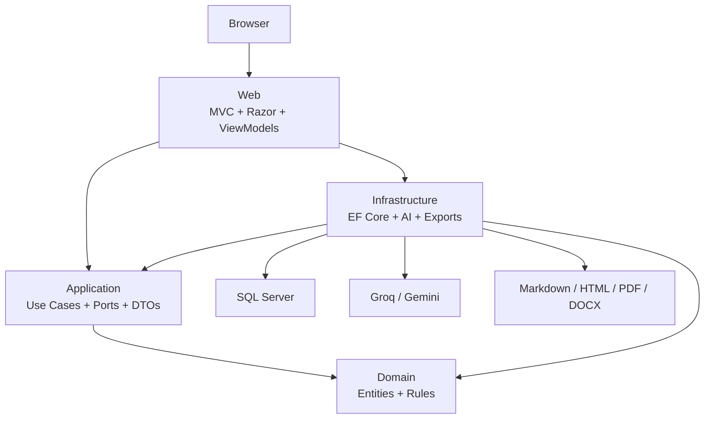

# Architecture Plan

## Project Name

Research Report Generator

## Purpose

Build a professional ASP.NET Core MVC application that allows authenticated users to generate intelligent research and recommendation reports. Users can choose a report mode, topic or topics, audience, style, depth, criteria or research focus areas, and constraints, then preview and export reports in Markdown, HTML, PDF, and DOCX.

The application should feel like the foundation of a real product, not a small demo. It should demonstrate strong Clean Architecture, practical AI integration, thoughtful user flows, and disciplined separation between Domain, Application, Infrastructure, and Web layers.

## Authentication Direction

Version 1 supports both local account authentication and Google login:

- ASP.NET Core Identity handles local email/password accounts, user IDs, roles, claims, and persisted login data.
- Google login is implemented through ASP.NET Core external authentication.
- Google client ID and client secret are configuration values and must never be committed to source control.
- A user who signs in with Google is still represented by an `ApplicationUser`, so report ownership works the same way for local and Google-authenticated users.
- Account linking may be added later; Version 1 only needs the standard external login flow.

## Architecture Style

Use a Clean Architecture modular monolith.

The system is deployed as one ASP.NET Core MVC web application, but the code is split into separate projects:

- `Domain`: business model and business rules
- `Application`: use cases, ports, DTOs, validators, result types, policies, and pipeline behaviors
- `Infrastructure`: SQL Server, EF Core, Identity persistence, AI providers, export renderers, seed data, and external integrations
- `Web`: MVC controllers, Razor views, view models, request/response mapping, middleware, filters, and composition root
- `Tests`: architecture, domain, application, infrastructure, and integration tests

## Clean Architecture Rules

### Dependency Direction

All dependencies point inward.

```text
Web -> Application -> Domain
Web -> Infrastructure -> Application -> Domain
Infrastructure -> Domain
```

Allowed project references:

```text
ResearchReportGenerator.Domain
  References:
    none

ResearchReportGenerator.Application
  References:
    ResearchReportGenerator.Domain

ResearchReportGenerator.Infrastructure
  References:
    ResearchReportGenerator.Application
    ResearchReportGenerator.Domain

ResearchReportGenerator.Web
  References:
    ResearchReportGenerator.Application
    ResearchReportGenerator.Infrastructure

ResearchReportGenerator.ArchitectureTests
  References:
    ResearchReportGenerator.Domain
    ResearchReportGenerator.Application
    ResearchReportGenerator.Infrastructure
    ResearchReportGenerator.Web

ResearchReportGenerator.DomainTests
  References:
    ResearchReportGenerator.Domain

ResearchReportGenerator.ApplicationTests
  References:
    ResearchReportGenerator.Domain
    ResearchReportGenerator.Application

ResearchReportGenerator.InfrastructureTests
  References:
    ResearchReportGenerator.Domain
    ResearchReportGenerator.Application
    ResearchReportGenerator.Infrastructure

ResearchReportGenerator.IntegrationTests
  References:
    ResearchReportGenerator.Web
```

Forbidden project references:

```text
Domain -> Application
Domain -> Infrastructure
Domain -> Web
Application -> Infrastructure
Application -> Web
Infrastructure -> Web
```

### Domain Rules

Domain contains business concepts only.

Allowed in Domain:

- Entities
- Aggregate roots
- Value objects
- Enums
- Domain events
- Domain errors
- Domain exceptions
- Pure domain services
- Business invariants

Forbidden in Domain:

- EF Core
- ASP.NET Core
- Identity
- HttpClient
- AI SDKs
- JSON attributes
- SQL Server
- File system
- Dependency injection
- View models
- Application DTOs

### Application Rules

Application owns use cases.

Allowed in Application:

- Commands
- Queries
- Command handlers
- Query handlers
- DTOs
- Result types
- Validators
- Pipeline behaviors
- Ports/interfaces needed by use cases
- Pure policies with no external I/O
- Strongly typed options/settings classes

Forbidden in Application:

- EF Core `DbContext`
- SQL Server implementation
- ASP.NET Core MVC types
- Razor view models
- Identity implementation
- HttpClient usage
- Groq/Gemini concrete clients
- PDF/DOCX library implementation
- File system implementation
- Infrastructure project reference

### Infrastructure Rules

Infrastructure implements technical adapters.

Allowed in Infrastructure:

- EF Core
- SQL Server
- Identity persistence
- Repository implementations
- AI provider implementations
- Export renderer implementations
- External HTTP calls
- Document-generation libraries
- Migrations
- Seed data
- Infrastructure interceptors

Forbidden in Infrastructure:

- MVC controllers
- Razor views
- UI decisions
- Business rules

### Web Rules

Web is the Presentation layer and composition root.

Allowed in Web:

- Controllers
- Razor views
- View models
- HTTP request mapping
- HTTP response mapping
- MVC filters
- Middleware
- Identity UI
- Static assets
- DI wiring
- Web adapters such as `CurrentUserService`

Forbidden in Web:

- EF Core queries inside controllers
- Direct AI provider calls inside controllers
- Business rules
- Passing Domain entities directly to Razor views
- Serializing EF Core entities or Domain aggregates directly

## High-Level System Diagram



## Complete Solution Structure

```text
research-and-recommendation-report/
  ResearchReportGenerator.sln
  README.md
  LICENSE
  .gitignore

  docs/
    project-idea.md
    project-vision-statement.md
    task-breakdown-delegation-plan.md
    architecture-plan.md
    database-design.md
    user-flows.md
    prompt-design.md
    export-design.md
    testing-plan.md
    implementation-roadmap.md

  src/
    ResearchReportGenerator.Domain/
      ResearchReportGenerator.Domain.csproj

      Common/
        Entity.cs
        AggregateRoot.cs
        AuditableEntity.cs
        SoftDeletableEntity.cs
        IDomainEvent.cs

      Entities/
        ReportRequest.cs
        ReportTopic.cs
        ReportCriterion.cs
        GeneratedReport.cs
        ReportGenerationRun.cs
        ReportCitation.cs
        ReportRecommendation.cs
        ReportTemplate.cs
        CriteriaPreset.cs
        ReportStylePreset.cs
        ReportExport.cs

      ValueObjects/
        ReportRequestId.cs
        GeneratedReportId.cs
        ReportGenerationRunId.cs
        ReportTitle.cs
        ReportTopicName.cs
        ReportCriterionName.cs
        ReportQualityScore.cs
        TokenUsage.cs
        PromptVersion.cs
        SourceUrl.cs

      Enums/
        AiProviderType.cs
        ExportFormat.cs
        GenerationStatus.cs
        RecommendationStrength.cs
        ReportMode.cs
        ReportLength.cs
        ReportStatus.cs
        ReportStyle.cs
        ReportVisibility.cs
        TechnicalDepth.cs

      Events/
        ReportRequestCreatedDomainEvent.cs
        ReportGenerationStartedDomainEvent.cs
        ReportGeneratedDomainEvent.cs
        ReportGenerationFailedDomainEvent.cs
        ReportExportedDomainEvent.cs
        ReportDeletedDomainEvent.cs

      Errors/
        DomainError.cs
        ReportDomainError.cs

      Exceptions/
        DomainException.cs
        ReportDomainException.cs
        InvalidReportRequestException.cs
        InvalidReportStateException.cs

      Services/
        ReportRequestDomainService.cs
        ReportQualityDomainService.cs

    ResearchReportGenerator.Application/
      ResearchReportGenerator.Application.csproj

      Common/
        Behaviors/
          AuthorizationBehavior.cs
          ValidationBehavior.cs
          LoggingBehavior.cs
          PerformanceBehavior.cs
          UnhandledExceptionBehavior.cs
        Errors/
          ApplicationError.cs
          ReportApplicationErrors.cs
          ExportApplicationErrors.cs
          AiApplicationErrors.cs
        Interfaces/
          ICommand.cs
          ICommandHandler.cs
          IQuery.cs
          IQueryHandler.cs
        Models/
          Result.cs
          ResultOfT.cs
          PagedResult.cs
          SortDirection.cs

      Abstractions/
        AI/
          IAiProvider.cs
          IAiProviderFactory.cs
          IAiPromptComposer.cs
          IAiResponseParser.cs
          IAiProviderHealthCheck.cs
        Auth/
          ICurrentUserService.cs
        Data/
          IApplicationDbContext.cs
          IUnitOfWork.cs
        Reports/
          IReportReadRepository.cs
          IReportWriteRepository.cs
          IReportTemplateReader.cs
          ICriteriaPresetReader.cs
          IReportStylePresetReader.cs
        Exports/
          IReportExportRenderer.cs
          IReportExportCoordinator.cs
        Time/
          IDateTimeProvider.cs

      DTOs/
        AI/
          AiGenerationRequest.cs
          AiGenerationResult.cs
          AiProviderHealthDto.cs
          AiProviderMetadataDto.cs
        Reports/
          ReportTopicDto.cs
          ReportCriterionDto.cs
          ReportInputOptionsDto.cs
          GeneratedReportDto.cs
          ReportPreviewDto.cs
          ReportHistoryItemDto.cs
          ReportDetailsDto.cs
          ReportGenerationRunDto.cs
          ReportQualityWarningDto.cs
          ReportCitationDto.cs
          ReportRecommendationDto.cs
        Exports/
          ExportReportDto.cs
          ExportReportResultDto.cs
        Presets/
          CriteriaPresetDto.cs
          ReportStylePresetDto.cs
          StyleSuggestionDto.cs
        Dashboard/
          DashboardDto.cs
          DashboardMetricDto.cs

      Features/
        Dashboard/
          GetDashboard/
            GetDashboardQuery.cs
            GetDashboardQueryHandler.cs
            GetDashboardResult.cs

        Reports/
          CreateReportRequest/
            CreateReportRequestCommand.cs
            CreateReportRequestCommandHandler.cs
            CreateReportRequestCommandValidator.cs
            CreateReportRequestResult.cs
          GenerateReport/
            GenerateReportCommand.cs
            GenerateReportCommandHandler.cs
            GenerateReportCommandValidator.cs
            GenerateReportResult.cs
          RegenerateReport/
            RegenerateReportCommand.cs
            RegenerateReportCommandHandler.cs
            RegenerateReportCommandValidator.cs
            RegenerateReportResult.cs
          GetReportPreview/
            GetReportPreviewQuery.cs
            GetReportPreviewQueryHandler.cs
            GetReportPreviewResult.cs
          GetReportDetails/
            GetReportDetailsQuery.cs
            GetReportDetailsQueryHandler.cs
            GetReportDetailsResult.cs
          GetReportHistory/
            GetReportHistoryQuery.cs
            GetReportHistoryQueryHandler.cs
            GetReportHistoryResult.cs
          SearchReports/
            SearchReportsQuery.cs
            SearchReportsQueryHandler.cs
            SearchReportsResult.cs
          DeleteReport/
            DeleteReportCommand.cs
            DeleteReportCommandHandler.cs
            DeleteReportCommandValidator.cs
            DeleteReportResult.cs

        Exports/
          ExportReport/
            ExportReportCommand.cs
            ExportReportCommandHandler.cs
            ExportReportCommandValidator.cs
            ExportReportResult.cs

        Presets/
          GetCriteriaPresets/
            GetCriteriaPresetsQuery.cs
            GetCriteriaPresetsQueryHandler.cs
            GetCriteriaPresetsResult.cs
          GetStylePresets/
            GetStylePresetsQuery.cs
            GetStylePresetsQueryHandler.cs
            GetStylePresetsResult.cs
          GetStyleSuggestions/
            GetStyleSuggestionsQuery.cs
            GetStyleSuggestionsQueryHandler.cs
            GetStyleSuggestionsResult.cs

        AI/
          GetAiProviderHealth/
            GetAiProviderHealthQuery.cs
            GetAiProviderHealthQueryHandler.cs
            GetAiProviderHealthResult.cs

      Policies/
        ReportPromptComposer.cs
        ReportQualityPolicy.cs
        StyleSuggestionPolicy.cs
        CriteriaSuggestionPolicy.cs
        ReportTitleSuggestionPolicy.cs
        ExportFileNamePolicy.cs

      Mapping/
        ReportApplicationMapper.cs
        DashboardApplicationMapper.cs
        PresetApplicationMapper.cs

      Options/
        AiOptions.cs
        AiProviderOptions.cs
        ReportGenerationOptions.cs
        ExportOptions.cs

      DependencyInjection.cs

    ResearchReportGenerator.Infrastructure/
      ResearchReportGenerator.Infrastructure.csproj

      AI/
        Common/
          AiProviderFactory.cs
          AiResponseParser.cs
          AiHttpClient.cs
          AiProviderFailureClassifier.cs
          AiProviderHealthCheck.cs
        Groq/
          GroqAiProvider.cs
          GroqOptions.cs
          GroqChatCompletionRequest.cs
          GroqChatCompletionResponse.cs
          GroqMessageDto.cs
        Gemini/
          GeminiAiProvider.cs
          GeminiOptions.cs
          GeminiGenerateContentRequest.cs
          GeminiGenerateContentResponse.cs
          GeminiContentDto.cs
        Fake/
          FakeAiProvider.cs

      Data/
        ApplicationDbContext.cs
        ApplicationDbContextFactory.cs
        UnitOfWork.cs
        Configurations/
          ReportRequestConfiguration.cs
          ReportTopicConfiguration.cs
          ReportCriterionConfiguration.cs
          GeneratedReportConfiguration.cs
          ReportGenerationRunConfiguration.cs
          ReportCitationConfiguration.cs
          ReportRecommendationConfiguration.cs
          ReportTemplateConfiguration.cs
          CriteriaPresetConfiguration.cs
          ReportStylePresetConfiguration.cs
          ReportExportConfiguration.cs
        Identity/
          ApplicationUser.cs
          ApplicationRole.cs
          IdentitySeeder.cs
        Interceptors/
          AuditableEntitySaveChangesInterceptor.cs
          SoftDeleteSaveChangesInterceptor.cs
        Migrations/
          .gitkeep
        Seed/
          CriteriaPresetSeeder.cs
          ReportStylePresetSeeder.cs
          ReportTemplateSeeder.cs
          DevelopmentDataSeeder.cs

      Authentication/
        GoogleAuthenticationOptions.cs

      Reports/
        Repositories/
          EfReportReadRepository.cs
          EfReportWriteRepository.cs
          EfReportTemplateReader.cs
          EfCriteriaPresetReader.cs
          EfReportStylePresetReader.cs
        Queries/
          ReportHistoryQueryBuilder.cs
          ReportSearchQueryBuilder.cs

      Exports/
        Common/
          ExportFileNameBuilder.cs
          MarkdownPipelineFactory.cs
          HtmlDocumentTemplate.cs
          ReportExportCoordinator.cs
        Markdown/
          MarkdownReportExportRenderer.cs
        Html/
          HtmlReportExportRenderer.cs
        Pdf/
          PdfReportExportRenderer.cs
          PdfOptions.cs
          PdfDocumentBuilder.cs
        Docx/
          DocxReportExportRenderer.cs
          DocxDocumentBuilder.cs
          DocxTableBuilder.cs

      Time/
        DateTimeProvider.cs

      DependencyInjection.cs

    ResearchReportGenerator.Web/
      ResearchReportGenerator.Web.csproj

      Controllers/
        HomeController.cs
        DashboardController.cs
        ReportsController.cs
        ExportsController.cs
        PresetsController.cs
        AiProvidersController.cs

      Areas/
        Identity/
          Pages/
            Account/
              Login.cshtml
              Login.cshtml.cs
              ExternalLogin.cshtml
              ExternalLogin.cshtml.cs
              Register.cshtml
              Register.cshtml.cs
              Logout.cshtml
              Logout.cshtml.cs
              AccessDenied.cshtml
              AccessDenied.cshtml.cs
              Manage/
                Index.cshtml
                Index.cshtml.cs

      Adapters/
        CurrentUserService.cs

      Filters/
        MapApplicationResultFilter.cs
        ValidateAntiForgeryFilter.cs

      Middleware/
        ExceptionHandlingMiddleware.cs
        RequestCorrelationMiddleware.cs

      Mapping/
        DashboardViewModelMapper.cs
        ReportViewModelMapper.cs
        ExportViewModelMapper.cs
        PresetViewModelMapper.cs
        ProblemDetailsMapper.cs

      ViewModels/
        Dashboard/
          DashboardViewModel.cs
          RecentReportViewModel.cs
          DashboardMetricViewModel.cs
          ProviderStatusViewModel.cs
        Reports/
          CreateReportViewModel.cs
          TopicInputViewModel.cs
          CriteriaInputViewModel.cs
          ReportHistoryViewModel.cs
          ReportHistoryItemViewModel.cs
          ReportDetailsViewModel.cs
          ReportPreviewViewModel.cs
          RegenerateReportViewModel.cs
          DeleteReportViewModel.cs
          ReportQualityWarningViewModel.cs
          ReportCitationViewModel.cs
          ReportRecommendationViewModel.cs
          GenerationRunViewModel.cs
        Exports/
          ExportButtonsViewModel.cs
          ExportDownloadErrorViewModel.cs
        Presets/
          CriteriaPresetViewModel.cs
          StylePresetViewModel.cs
          StyleSuggestionViewModel.cs
        Shared/
          SelectOptionViewModel.cs
          ErrorViewModel.cs

      Views/
        Home/
          Index.cshtml
          Privacy.cshtml
        Dashboard/
          Index.cshtml
        Reports/
          Index.cshtml
          Create.cshtml
          Details.cshtml
          Preview.cshtml
          Regenerate.cshtml
          Delete.cshtml
        Exports/
          DownloadError.cshtml
        Shared/
          _Layout.cshtml
          _ValidationScriptsPartial.cshtml
          _StatusMessage.cshtml
          Error.cshtml
          Components/
            ReportStatusBadge.cshtml
            ExportButtons.cshtml
            QualityScoreBadge.cshtml
            CriteriaChips.cshtml
            CitationList.cshtml
            GenerationMetadata.cshtml
            ProviderStatusBadge.cshtml

      wwwroot/
        css/
          site.css
          dashboard.css
          report-form.css
          report-preview.css
        js/
          create-report.js
          report-preview.js
          preset-suggestions.js
          export-actions.js
        images/
          .gitkeep

      Program.cs
      appsettings.json
      appsettings.Development.json
      appsettings.Production.json

  tests/
    ResearchReportGenerator.ArchitectureTests/
      ResearchReportGenerator.ArchitectureTests.csproj
      DependencyRuleTests.cs
      LayerDependencyTests.cs
      NamingConventionTests.cs

    ResearchReportGenerator.DomainTests/
      ResearchReportGenerator.DomainTests.csproj
      ReportRequestTests.cs
      GeneratedReportTests.cs
      ReportGenerationRunTests.cs
      ReportQualityScoreTests.cs
      ReportTitleTests.cs

    ResearchReportGenerator.ApplicationTests/
      ResearchReportGenerator.ApplicationTests.csproj
      Features/
        CreateReportRequestCommandHandlerTests.cs
        GenerateReportCommandHandlerTests.cs
        RegenerateReportCommandHandlerTests.cs
        ExportReportCommandHandlerTests.cs
        GetReportPreviewQueryHandlerTests.cs
        SearchReportsQueryHandlerTests.cs
      Policies/
        ReportPromptComposerTests.cs
        ReportQualityPolicyTests.cs
        StyleSuggestionPolicyTests.cs
        CriteriaSuggestionPolicyTests.cs
        ExportFileNamePolicyTests.cs
      Fakes/
        FakeCurrentUserService.cs
        FakeReportReadRepository.cs
        FakeReportWriteRepository.cs
        FakeAiProvider.cs
        FakeReportExportCoordinator.cs
        FakeDateTimeProvider.cs

    ResearchReportGenerator.InfrastructureTests/
      ResearchReportGenerator.InfrastructureTests.csproj
      AI/
        FakeAiProviderTests.cs
        AiResponseParserTests.cs
        AiProviderFactoryTests.cs
      Exports/
        MarkdownReportExportRendererTests.cs
        HtmlReportExportRendererTests.cs
        DocxReportExportRendererTests.cs
      Data/
        ReportRepositoryTests.cs
        ReportSearchQueryBuilderTests.cs

    ResearchReportGenerator.IntegrationTests/
      ResearchReportGenerator.IntegrationTests.csproj
      TestWebApplicationFactory.cs
      Auth/
        AuthenticationFlowTests.cs
      Reports/
        ReportCreationFlowTests.cs
        ReportOwnershipTests.cs
        ReportHistoryTests.cs
        ReportRegenerationTests.cs
      Exports/
        ReportExportFlowTests.cs

  scripts/
    setup-dev-db.ps1
    add-migration.ps1
    update-database.ps1
    run-tests.ps1
```

## Domain Model

### ReportRequest

Represents the user's original request.

Responsibilities:

- Own report mode, report title, audience, style, depth, length, and constraints.
- Support single-topic research reports and multi-topic comparison reports.
- Require at least one topic.
- Require meaningful criteria for comparison reports.
- Allow optional research focus areas for single-topic reports.
- Track status changes.
- Raise domain events when created or deleted.

### GeneratedReport

Represents the generated canonical report.

Responsibilities:

- Store Markdown content.
- Store summary.
- Store provider/model metadata.
- Store quality score.
- Track status.
- Prevent invalid state transitions.

### ReportGenerationRun

Represents one AI generation attempt.

Responsibilities:

- Track provider, model, prompt, raw response, timing, token usage, and error state.
- Preserve regeneration history.

### ReportExport

Represents one export action.

Responsibilities:

- Track report ID, user ID, format, file name, content type, and export time.

## Application Use Cases

### Dashboard

- `GetDashboardQuery`
- Shows user report count, recent reports, provider status, and quick actions.

### Report Creation

- `CreateReportRequestCommand`
- Saves the user's structured report request.
- Supports both single-topic research and multi-topic comparison modes.

### Report Generation

- `GenerateReportCommand`
- Composes prompt.
- Calls AI provider through `IAiProvider`.
- Saves generated report.
- Saves generation run.
- Calculates quality score.

### Report Regeneration

- `RegenerateReportCommand`
- Creates a new generation run for an existing report request.
- Allows style, depth, provider, or notes to change.

### Report Preview

- `GetReportPreviewQuery`
- Loads generated report owned by the current user.
- Returns preview DTO.

### Report History

- `GetReportHistoryQuery`
- `SearchReportsQuery`
- Lists and searches user-owned reports.

### Report Delete

- `DeleteReportCommand`
- Soft deletes a user-owned report.

### Export

- `ExportReportCommand`
- Verifies ownership.
- Calls export coordinator.
- Returns file data DTO to Web.

### Presets

- `GetCriteriaPresetsQuery`
- `GetStylePresetsQuery`
- `GetStyleSuggestionsQuery`

### AI Provider Health

- `GetAiProviderHealthQuery`
- Displays provider availability and configuration state.

## Infrastructure Implementations

### Persistence

Implemented by:

- `ApplicationDbContext`
- `EfReportReadRepository`
- `EfReportWriteRepository`
- `EfReportTemplateReader`
- `EfCriteriaPresetReader`
- `EfReportStylePresetReader`
- `UnitOfWork`

### AI

Implemented by:

- `GroqAiProvider`
- `GeminiAiProvider`
- `FakeAiProvider`
- `AiProviderFactory`
- `AiProviderHealthCheck`

### Export

Implemented by:

- `MarkdownReportExportRenderer`
- `HtmlReportExportRenderer`
- `PdfReportExportRenderer`
- `DocxReportExportRenderer`
- `ReportExportCoordinator`

### Time

Implemented by:

- `DateTimeProvider`

## Web Responsibilities

### Controllers

`HomeController`

- Landing page.
- Privacy page.

`DashboardController`

- User dashboard.

`ReportsController`

- Report history.
- Create report form.
- Report details.
- Preview.
- Regeneration.
- Delete confirmation.

`ExportsController`

- Download reports.

`PresetsController`

- Criteria and style suggestions for UI.

`AiProvidersController`

- Provider health/status display.

### Web Adapter

`CurrentUserService`

- Implements `ICurrentUserService`.
- Reads user ID from `HttpContext.User`.
- Lives in Web because `HttpContext` is Presentation infrastructure.

## Complete User Flows

### Flow 1: Visitor Opens App

1. Visitor opens `/`.
2. `HomeController.Index` returns landing page.
3. Visitor sees value proposition and actions.
4. Visitor chooses register or login.

### Flow 2: User Registers

1. User opens register page.
2. User enters display name, email, and password.
3. Identity validates input.
4. Identity creates `ApplicationUser`.
5. User is signed in.
6. App redirects to dashboard.

### Flow 3: User Logs In With Email and Password

1. User opens login page.
2. User enters email and password.
3. Identity validates credentials.
4. App redirects to dashboard.

### Flow 3A: User Logs In With Google

1. User opens login page.
2. User clicks `Continue with Google`.
3. App redirects to Google's OAuth consent/sign-in flow.
4. Google redirects back to the app's external login callback.
5. Identity validates the external login information.
6. If this Google login is new, the app creates an `ApplicationUser`.
7. App signs the user in and redirects to dashboard.

### Flow 4: User Opens Dashboard

1. User opens `/dashboard`.
2. `DashboardController` sends `GetDashboardQuery`.
3. Query handler loads report summary through `IReportReadRepository`.
4. Web maps dashboard DTO to view model.
5. Razor view renders dashboard.

### Flow 5: User Starts Guided Report Creation

1. User clicks `New Report`.
2. `ReportsController.Create` sends queries for presets.
3. Web renders guided wizard.
4. Wizard sections:
   - Report goal and title
   - Report mode
   - Topics
   - Audience
   - Style
   - Depth and length
   - Research focus areas or comparison criteria
   - Optional constraints
   - Review

### Flow 6: User Gets Suggestions

1. User enters topics or category.
2. Browser calls `PresetsController`.
3. Controller sends suggestion query.
4. Application uses pure suggestion policies and preset readers.
5. UI shows suggested research focus areas or comparison criteria, style, and depth.

### Flow 7: User Submits Report Request

1. User submits create form.
2. Web validates request shape.
3. Web maps view model to `CreateReportRequestCommand`.
4. Application validates command.
5. Handler creates `ReportRequest`.
6. Domain validates invariants.
7. Handler saves through repository port.
8. Handler commits through unit of work.
9. Web redirects to generation step.

### Flow 8: AI Generation Succeeds

1. Web sends `GenerateReportCommand`.
2. Handler loads report request by current user ID.
3. Handler composes prompt.
4. Handler gets provider from `IAiProviderFactory`.
5. Infrastructure provider calls Groq or Gemini.
6. Handler receives AI result.
7. Handler calculates quality score.
8. Handler creates `GeneratedReport`.
9. Handler stores `ReportGenerationRun`.
10. Handler commits.
11. Web redirects to preview.

### Flow 9: AI Generation Fails

1. AI provider fails, times out, or returns invalid content.
2. Infrastructure classifies the provider failure.
3. Application stores failed generation run.
4. Application returns failure result.
5. Web displays friendly retry options.
6. User can retry with same provider or switch provider.

### Flow 10: User Previews Report

1. User opens preview page.
2. Web sends `GetReportPreviewQuery`.
3. Handler verifies ownership.
4. Handler returns report preview DTO.
5. Web maps DTO to view model.
6. Razor renders Markdown preview, metadata, quality score, warnings, citations, and export buttons.

### Flow 11: User Downloads Report

1. User clicks export format.
2. Web sends `ExportReportCommand`.
3. Handler verifies ownership.
4. Handler calls `IReportExportCoordinator`.
5. Infrastructure selects renderer.
6. Renderer produces file bytes.
7. Web returns file response.

### Flow 12: User Searches Report History

1. User opens report history.
2. User searches by title, topic, date, status, style, or provider.
3. Web sends `SearchReportsQuery`.
4. Handler returns paged results.
5. Web renders history list.

### Flow 13: User Regenerates Report

1. User opens preview.
2. User clicks regenerate.
3. User optionally changes style, depth, provider, or extra notes.
4. Web sends `RegenerateReportCommand`.
5. Handler creates new generation run.
6. Handler generates new report version.
7. User previews latest version.

### Flow 14: User Deletes Report

1. User opens report details or history.
2. User clicks delete.
3. Web asks for confirmation.
4. Web sends `DeleteReportCommand`.
5. Handler verifies ownership.
6. Report is soft deleted.
7. Report disappears from normal history.

### Flow 15: Developer Adds New AI Provider

1. Add options class in Infrastructure.
2. Add provider class implementing `IAiProvider`.
3. Register provider in `Infrastructure.DependencyInjection`.
4. Update provider factory.
5. Application use cases remain unchanged.
6. Web controllers remain unchanged.

## Database Tables

```text
AspNetUsers
AspNetRoles
AspNetUserClaims
AspNetUserLogins
AspNetUserRoles
AspNetUserTokens
AspNetRoleClaims

ReportRequests
ReportTopics
ReportCriteria
GeneratedReports
ReportGenerationRuns
ReportCitations
ReportRecommendations
ReportExports
ReportTemplates
CriteriaPresets
ReportStylePresets
```

## Main Table Columns

```text
ReportRequests
  Id
  UserId
  ReportMode
  Title
  TargetAudience
  ReportStyle
  TechnicalDepth
  ReportLength
  IndustryOrDomain
  CurrentTechnologyStack
  PerformanceRequirements
  SecurityRequirements
  BudgetConsiderations
  MustInclude
  MustAvoid
  PreferredAiProvider
  Status
  CreatedAtUtc
  UpdatedAtUtc
  DeletedAtUtc

ReportTopics
  Id
  ReportRequestId
  Name
  Description
  SortOrder

ReportCriteria
  Id
  ReportRequestId
  Name
  Description
  Weight
  SortOrder

GeneratedReports
  Id
  ReportRequestId
  UserId
  Title
  MarkdownContent
  Summary
  AiProvider
  ModelName
  PromptVersion
  Status
  QualityScore
  QualityWarningsJson
  GeneratedAtUtc
  UpdatedAtUtc
  DeletedAtUtc

ReportGenerationRuns
  Id
  ReportRequestId
  GeneratedReportId
  UserId
  AiProvider
  ModelName
  PromptText
  RawResponse
  Status
  ErrorCode
  ErrorMessage
  StartedAtUtc
  CompletedAtUtc
  DurationMs
  InputTokens
  OutputTokens

ReportCitations
  Id
  GeneratedReportId
  Title
  Url
  SourceName
  PublishedAtUtc
  AccessedAtUtc
  Notes
  SortOrder

ReportRecommendations
  Id
  GeneratedReportId
  Scenario
  RecommendedOption
  Reasoning
  Strength
  SortOrder

ReportExports
  Id
  GeneratedReportId
  UserId
  ExportFormat
  FileName
  ContentType
  CreatedAtUtc

ReportTemplates
  Id
  Name
  Description
  SystemPrompt
  UserPromptTemplate
  IsActive
  CreatedAtUtc
  UpdatedAtUtc

CriteriaPresets
  Id
  Name
  Description
  Category
  CriteriaJson
  IsActive
  SortOrder

ReportStylePresets
  Id
  Name
  Description
  RecommendedAudience
  DefaultDepth
  IsActive
  SortOrder
```

## AI Design

Application defines:

```text
IAiProvider
IAiProviderFactory
IAiPromptComposer
IAiResponseParser
IAiProviderHealthCheck
AiGenerationRequest
AiGenerationResult
```

Infrastructure implements:

```text
GroqAiProvider
GeminiAiProvider
FakeAiProvider
AiProviderFactory
AiResponseParser
AiProviderHealthCheck
```

Rules:

- Application handlers call `IAiProvider`, never `GroqAiProvider` or `GeminiAiProvider`.
- Groq and Gemini HTTP details stay in Infrastructure.
- Fake provider is used for tests and local development.
- Prompt composition is pure and can live in Application.
- Provider API keys are stored in user secrets or environment variables.

## Export Design

Application defines:

```text
IReportExportRenderer
IReportExportCoordinator
ExportReportCommand
ExportReportResultDto
```

Infrastructure implements:

```text
MarkdownReportExportRenderer
HtmlReportExportRenderer
PdfReportExportRenderer
DocxReportExportRenderer
ReportExportCoordinator
```

Rules:

- Markdown is canonical.
- HTML is rendered from Markdown.
- PDF is rendered from HTML or PDF library.
- DOCX is rendered through document builder.
- Web only returns the file response.
- Application never references PDF or DOCX library types.

## Security Design

Required:

- Authentication for dashboard, reports, generation, preview, export, regeneration, and delete.
- Local Identity login and Google external login are both supported authentication paths.
- Every report query must include current user ID.
- Use cases enforce ownership through repository ports.
- Controllers do not query the database for ownership.
- Anti-forgery tokens on forms.
- Server-side validation for commands.
- API keys never committed.
- Google OAuth client ID and client secret never committed.
- Prompt logging disabled by default.
- Soft delete for reports.

Ownership pattern:

```csharp
await db.GeneratedReports
    .Where(report => report.UserId == userId)
    .Where(report => report.Id == reportId)
    .Where(report => report.DeletedAtUtc == null)
    .FirstOrDefaultAsync(cancellationToken);
```

## Error Handling

Expected failures return Result types:

- Report not found
- User does not own report
- Invalid report request
- AI empty output
- Unsupported export format
- Quality validation failed

Unexpected failures use exceptions:

- SQL Server unavailable
- AI provider network timeout
- File rendering library crash
- Programming errors

Mapping:

```text
Domain error -> Application error -> Web validation message or ProblemDetails
Infrastructure exception -> Web exception middleware -> friendly error page or 503
```

## Cross-Cutting Concerns

Application pipeline behaviors:

- `ValidationBehavior`
- `AuthorizationBehavior`
- `LoggingBehavior`
- `PerformanceBehavior`
- `UnhandledExceptionBehavior`

Web middleware:

- `ExceptionHandlingMiddleware`
- `RequestCorrelationMiddleware`
- Authentication middleware
- Authorization middleware

Infrastructure interceptors:

- `AuditableEntitySaveChangesInterceptor`
- `SoftDeleteSaveChangesInterceptor`

Rules:

- Application behaviors may use abstractions such as `ILogger<T>`.
- Application behaviors must not use concrete Infrastructure classes.
- Middleware handles HTTP-level concerns.
- EF Core interceptors handle persistence-level concerns.

## Configuration and Settings Pattern

The application uses the ASP.NET Core options/settings pattern for application-level configuration.

Configuration files:

- `appsettings.json`
- `appsettings.Development.json`
- `appsettings.Production.json`

Rules:

- `appsettings.json` contains safe defaults shared by all environments.
- `appsettings.Development.json` contains local development overrides, such as LocalDB and fake AI defaults.
- `appsettings.Production.json` contains production behavior overrides, but no committed secrets.
- API keys, production connection strings, and other secrets must come from user secrets, environment variables, or deployment secret storage.
- Web `Program.cs` is the composition root and passes `builder.Configuration` into Application and Infrastructure registration.
- Application owns application-level settings classes under `Application/Options`.
- Infrastructure owns adapter-specific settings classes, such as Google OAuth configuration.
- Settings are registered with `IOptions<T>` and validated on startup.
- Application and Infrastructure services consume `IOptions<T>` instead of reading raw configuration directly, except for infrastructure bootstrap concerns such as connection-string setup.

Current application-level settings:

- `AiOptions`
- `AiProviderOptions`
- `ReportGenerationOptions`
- `ExportOptions`

Current infrastructure-specific settings:

- `GoogleAuthenticationOptions`

Google authentication configuration shape:

```json
{
  "Authentication": {
    "Google": {
      "ClientId": "",
      "ClientSecret": "",
      "CallbackPath": "/signin-google"
    }
  }
}
```

Rules:

- Development secrets can be stored with user secrets or environment variables.
- Production secrets must be supplied by the hosting platform or secret manager.
- The committed `appsettings.*.json` files may include empty placeholders, but never real Google credentials.
- The callback URL registered in Google Cloud Console must match the app's configured callback path and deployed host.

## Dependency Injection

Web `Program.cs` is the composition root.

```csharp
builder.Services.AddApplication(builder.Configuration);
builder.Services.AddInfrastructure(builder.Configuration);
builder.Services.AddScoped<ICurrentUserService, CurrentUserService>();
builder.Services.AddControllersWithViews();
```

Application registration:

- MediatR handlers
- Validators
- Pipeline behaviors
- Pure policies
- Strongly typed options with validation

Infrastructure registration:

- EF Core
- Identity stores
- Google external authentication
- Repositories
- AI providers
- Export renderers
- Unit of work
- Date/time provider

Web registration:

- MVC
- Razor views
- Identity UI
- HttpContext accessor
- Web adapters

## Suggested Packages

Domain:

- No package preferred

Application:

- `MediatR`
- `FluentValidation`
- `Microsoft.Extensions.Options.ConfigurationExtensions`
- `Microsoft.Extensions.Options.DataAnnotations`

Infrastructure:

- `Microsoft.AspNetCore.Authentication.Google`
- `Microsoft.EntityFrameworkCore.SqlServer`
- `Microsoft.EntityFrameworkCore.Tools`
- `Microsoft.AspNetCore.Identity.EntityFrameworkCore`
- `Markdig`
- `DocumentFormat.OpenXml`
- PDF package selected during implementation

Web:

- `Microsoft.AspNetCore.Identity.UI`

Tests:

- `xunit`
- `FluentAssertions`
- `Moq` or `NSubstitute`
- `Microsoft.AspNetCore.Mvc.Testing`
- `NetArchTest.Rules`

## Architecture Fitness Tests

Required tests:

```text
Domain must not reference Application.
Domain must not reference Infrastructure.
Domain must not reference Web.
Application must not reference Infrastructure.
Application must not reference Web.
Infrastructure must not reference Web.
Web controllers must not reference Infrastructure namespaces.
Web controllers must not reference Domain entities directly.
Application handlers must not use EF Core namespaces.
Application handlers must not use HttpClient.
Application handlers must not use ASP.NET Core MVC types.
Export implementations must live in Infrastructure.
AI provider implementations must live in Infrastructure.
CurrentUserService must live in Web.
```

## Build Phases

### Phase 1: Solution Foundation

1. Create solution.
2. Create projects.
3. Add project references.
4. Add architecture tests.
5. Add base Domain and Application primitives.

### Phase 2: Authentication and Persistence

1. Add Identity.
2. Add local email/password login and registration.
3. Add Google login authentication.
4. Add SQL Server.
5. Add EF Core configurations.
6. Add migrations.
7. Add seed data.

### Phase 3: Report Flow With Fake AI

1. Build dashboard.
2. Build guided report wizard.
3. Save report request.
4. Generate fake Markdown report.
5. Save generated report.
6. Preview report.
7. Show history.

### Phase 4: Real AI

1. Add Groq provider.
2. Add Gemini provider.
3. Add provider factory.
4. Add provider health.
5. Add generation metadata.

### Phase 5: Product Quality

1. Add criteria presets.
2. Add style suggestions.
3. Add report quality score.
4. Add regeneration.
5. Add searchable history.

### Phase 6: Exports

1. Markdown export.
2. HTML export.
3. PDF export.
4. DOCX export.
5. Export buttons.
6. Download error handling.

### Phase 7: Tests and Polish

1. Domain tests.
2. Application handler tests.
3. Infrastructure tests.
4. Integration tests.
5. UI polish.
6. README setup instructions.

## Product Features

Core features:

- Register
- Login with email and password
- Login with Google
- Dashboard
- Guided report creation wizard
- Single-topic research reports
- Topic comparison
- Audience selection
- Style selection
- Depth selection
- Research focus or criteria selection
- Optional constraints
- AI generation
- Preview
- Export
- Report history
- Search
- Regeneration
- Delete

Impressive features:

- Style suggestions
- Criteria presets
- Report quality score
- Quality warnings
- Provider health display
- AI generation run history
- Fake provider for testing
- Provider abstraction
- Markdown canonical content
- Architecture fitness tests
- Strict ownership checks
- Soft delete
- Friendly AI failure recovery

## Definition of Done

The architecture is complete when:

- Domain has direct folders such as `Entities`, `Enums`, `ValueObjects`, `Events`, `Errors`, `Exceptions`, and `Services`.
- Domain has no dependency on Application, Infrastructure, Web, EF Core, or ASP.NET Core.
- Application references Domain only.
- Application contains use cases and ports, not Infrastructure implementations.
- Infrastructure implements persistence, AI, export, and technical adapters.
- Web controllers dispatch Application commands and queries.
- Web maps view models to Application requests and Application results back to views.
- No Domain entities are passed directly to Razor views.
- No controller calls `DbContext`.
- No Application handler references `HttpClient`, `DbContext`, or MVC types.
- Architecture tests enforce the dependency rules.
- Users can register, generate reports, preview reports, regenerate reports, search history, and export all required formats.
